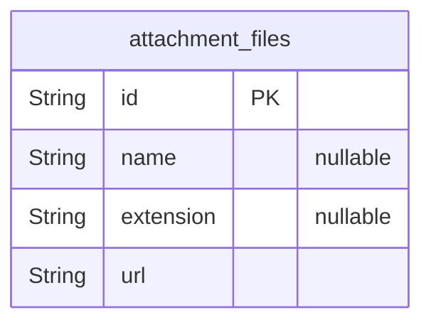
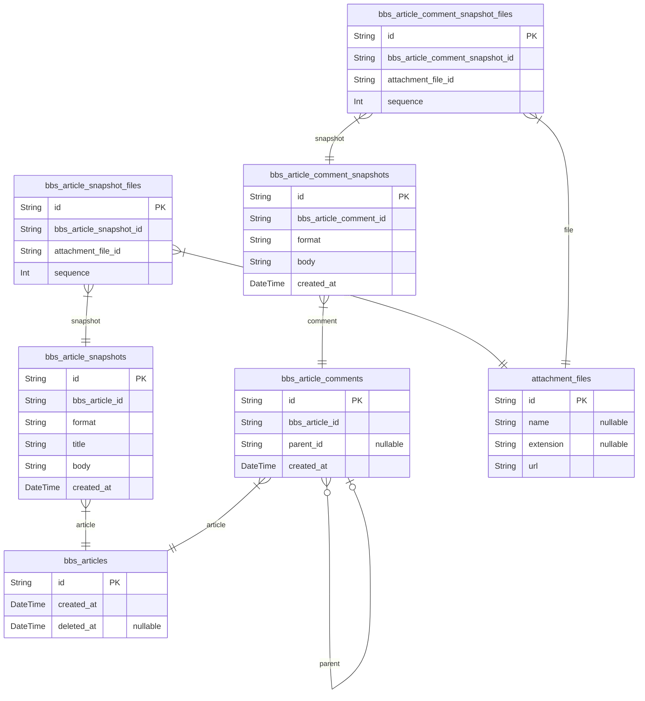

# Prisma Markdown
Generated by [`prisma-markdown`](https://github.com/samchon/prisma-markdown)

## Filesystem

### attachment_files
첨부 파일.

본 DB 의 모든 곳에서 사용되는 첨부파일 엔티티.

  - Properties
    - `id`
    - `name`: 파일명, 확장자 제외.
    - `extension`: 확장자.
    - `url`: 파일의 URL 경로.

## Articles

### bbs_articles
게시물 엔티티.

`bbs_articles` 은 현행 쇼핑몰 시스템에 존재하는 모든 종류의 게시물에 대한 
슈퍼타입 엔티티로써, 문자 그대로 게시판의 개별 게시물을 형상화하였다.

그리고 게시물에 필연적으로 존재해야하는 제목이나 본문같은 요소들이 본 
`bbs_articles` 에 존재하지 않고, 그보다 하위 엔티티엔 
[bbs_article_snapshots](#bbs_article_snapshots) 에 1: N 의 관계로써 존재하는데, 이는 게시물을
수정할 때마다 새로운 스냅샷 레코드를 발행하기 때문이다.

이렇게 게시물을 수정할 때마다 새로운 스냅샷 레코드를 발행하는 이유는, 바로 증거를 
보존하기 위함이다. 전자상거래의 특성상, 참여자들 간에는 늘 분쟁의 위협이 도사린다. 
그리고 게시물이나 그 댓글을 통해서도 다툼이 일어날 수 있는데, 이 때 기존 게시물을 
수정하여 정황을 조작하는 일 등을 막기 위하여, 게시물이 이러한 구조로 설계된 것. 

이른바 '밑장빼기' 방지용.

  - Properties
    - `id`
    - `created_at`: 게시물 생성 일시.
    - `deleted_at`: 게시물 삭제 일시.

### bbs_article_snapshots
게시물 스냅샷

`bbs_article_snapshots` 은 게시물의 컨텐츠를 담은 스냅샷 엔티티로써, 
[bbs_articles](#bbs_articles) 에서도 설명한 바 있듯이, 밑장빼기 방지를 위하여 컨텐츠를
게시물 레코드에서 분리하였다.

  - Properties
    - `id`
    - `bbs_article_id`: 귀속 게시물의 [bbs_articles.id](#bbs_articles)
    - `format`
      - 본문의 형식.
      - 확장자의 비슷한 의미: html, md, txt 등
    - `title`: 게시물의 제목
    - `body`: 게시물 본문 컨텐츠
    - `created_at`: 레코드 생성 일시 (게시물의 최초 생성일시 또는 편집일시)

### bbs_article_snapshot_files
게시물 스냅샷의 첨부 파일.

`bbs_article_snapshot_files` 는 게시물 스냅샷의 첨부 파일을 형상화한 엔티티이다.

`bbs_article_snapshot_files` 는 [bbs_article_snapshots](#bbs_article_snapshots) 와 
[attachment_files](#attachment_files) 간의 M: N 관계를 해소하기 위한, 전형적인 
pair relationship 테이블이다. 그리고 첨부파일의 순서를 보장하기 위하여 
[bbs_article_snapshot_files.sequence](#bbs_article_snapshot_files) 속성을 추가로 가지는데, 앞으로 계속
보게 될 패턴이니, 미리 미리 익숙해지자.

  - Properties
    - `id`
    - `bbs_article_snapshot_id`: 귀속 게시물 스냅샷의 [bbs_article_snapshots.id](#bbs_article_snapshots)
    - `attachment_file_id`: 귀속 첨부 파일의 [attachment_files.id](#attachment_files)
    - `sequence`: 게시물 스냅샷 내 첨부파일의 배열상 배치 순서.

### bbs_article_comments
게시물에 작성한 댓글.

`bbs_article_comments` 는 게시물에 작성한 댓글을 형상화한 엔티티이다.

그리고 이 댓글 또한, 앞서 [bbs_articles](#bbs_articles) 및 [bbs_article_snapshots](#bbs_article_snapshots) 
간의 관계가 그러하였듯, 증거주의를 위하여 댓글의 본문을 하위 
[bbs_article_comment_snapshots](#bbs_article_comment_snapshots) 에 저장하고, 댓글을 수정할 때마다 새로운 
스냅샷 레코드를 발행하고 있다.

또한, [bbs_article_comments.parent_id](#bbs_article_comments) 속성을 통하여, 대댓글의 관계를 
표현하고 있다.

  - Properties
    - `id`
    - `bbs_article_id`: 귀속 게시물의 [bbs_articles.id](#bbs_articles)
    - `parent_id`
      - 부모 댓글의 ID.
      - 대댓글을 작성할 때 사용한다.
    - `created_at`: 댓글 생성 일시.

### bbs_article_comment_snapshots
댓글 스냅샷.

`bbs_article_comment_snapshots` 는 댓글의 본 컨텐츠를 담은 스냅샷 엔티티이다. 

위 {@link bbs_article_comments) 에서 설명하였듯, 밑장빼기 방지용.

  - Properties
    - `id`
    - `bbs_article_comment_id`: 귀속 게시물 댓글의 [bbs_article_comments.id](#bbs_article_comments)
    - `format`
      - 본문의 형식.
      - 확장자의 비슷한 의미: html, md, txt 등
    - `body`: 댓글 본문.
    - `created_at`: 레코드 생성 일시 (댓글의 최초 생성일시 또는 편집일시)

### bbs_article_comment_snapshot_files
댓글 스냅샷의 첨부 파일.

[bbs_article_comment_snapshots](#bbs_article_comment_snapshots) [attachment_files](#attachment_files) 의 
M: N 관계 해소용.

  - Properties
    - `id`
    - `bbs_article_comment_snapshot_id`: 귀속 댓글 스냅샷의 [bbs_article_comment_snapshots.id](#bbs_article_comment_snapshots)
    - `attachment_file_id`: 귀속 첨부파일의 [attachment_files.id](#attachment_files)
    - `sequence`
      - 배치 순서.
      - 댓글 스냅샷에 첨부된 파일들의 배열 상 배치 순서.