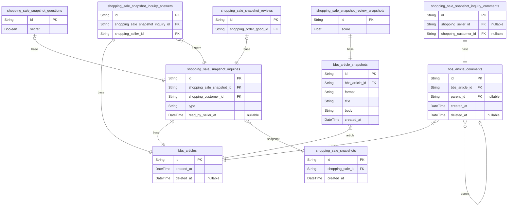

# Shopping Mall
> Generated by [`prisma-markdown`](https://github.com/samchon/prisma-markdown)

- [Articles](#Articles)
- [Systematic](#Systematic)
- [Actors](#Actors)
- [Sales](#Sales)
- [Carts](#Carts)
- [Orders](#Orders)
- [Coupons](#Coupons)
- [Coins](#Coins)
- [Inquiries](#Inquiries)

## Articles

### `attachment_files`
Attachment File.

Every attachment files that are managed in this shopping mall system.

For reference, it is possible to omit one of file name or extension like 
`.gitignore` or `README` case, but not possible to omit both of them,

**Properties**
  - `id`: 
  - `name`
    > File name, except extension.
    > 
    > Possible to omit like `.gitignore` case.
  - `extension`
    > Extension.
    > 
    > Possible to omit like `README` case.
  - `url`: URL path of the real file.

### `bbs_articles`
Article entity.

`bbs_articles` is a super-type entity of all kinds of articles in the 
current shopping mall system, literally shaping individual articles of 
the bulletin board.

And, as you can see, the elements that must inevitably exist in the 
article, such as the title or the body, do not exist in the `bbs_articles`, 
but exist in the subsidiary entity, [bbs_article_snapshots](#bbs_article_snapshots), as a 
1: N relationship, which is because a new snapshot record is published 
every time the article is modified.

The reason why a new snapshot record is published every time the article 
is modified is to preserve the evidence. Due to the nature of e-commerce, 
there is always a threat of dispute among the participants. And it can 
happen that disputes arise through articles or comments, and to prevent 
such things as modifying existing articles to manipulate the situation, 
the article is designed in this structure.

In other words, to keep evidence, and prevent fraud.

**Properties**
  - `id`: 
  - `created_at`: Creation time of article.
  - `deleted_at`
    > Deletion time of article.
    > 
    > To keep evidence, do not delete the article, but just mark it as 
    > deleted.

### `bbs_article_snapshots`
Snapshot of article.

`bbs_article_snapshots` is a snapshot entity that contains the contents of
the article, as mentioned in [bbs_articles](#bbs_articles), the contents of the 
article are separated from the article record to keep evidence and prevent 
fraud.

**Properties**
  - `id`: 
  - `bbs_article_id`: Belong article's [bbs_articles.id](#bbs_articles)
  - `format`
    > Format of body.
    > 
    > Same meaning with extension like `html`, `md`, `txt`.
  - `title`: Title of article.
  - `body`: Content body of article.
  - `created_at`
    > Creation time of record.
    > 
    > It means creation time or update time or article.

### `bbs_article_snapshot_files`
Attachment file of article snapshot.

`bbs_article_snapshot_files` is an entity that shapes the attached files of
the article snapshot.

`bbs_article_snapshot_files` is a typical pair relationship table to 
resolve the M: N relationship between [bbs_article_snapshots](#bbs_article_snapshots) and
[attachment_files](#attachment_files) tables. Also, to ensure the order of the attached
files, it has an additional `sequence` attribute, which we will continue to
see in this documents.

**Properties**
  - `id`: 
  - `bbs_article_snapshot_id`: Belonged snapshot's [bbs_article_snapshots.id](#bbs_article_snapshots)
  - `attachment_file_id`: Belonged file's [attachment_files.id](#attachment_files)
  - `sequence`: Sequence of attachment file in the snapshot.

### `bbs_article_comments`
Comment written on an article.

`bbs_article_comments` is an entity that shapes the comments written on an
article.

And for this comment, as in the previous relationship between 
[bbs_articles](#bbs_articles) and [bbs_article_snapshots](#bbs_article_snapshots), the content body 
of the comment is stored in the sub [bbs_article_comment_snapshots](#bbs_article_comment_snapshots) 
table for evidentialism, and a new snapshot record is issued every time 
the comment is modified.

Also, `bbs_article_comments} is expressing the relationship of the 
hierarchical reply structure through the `parent_id` attribute.

**Properties**
  - `id`: 
  - `bbs_article_id`: Belonged article's [bbs_articles.id](#bbs_articles)
  - `parent_id`
    > Parent comment's [bbs_article_comments.id](#bbs_article_comments)
    > 
    > Used to express the hierarchical reply structure.
  - `created_at`: Creation time of comment.
  - `deleted_at`
    > Deletion time of comment.
    > 
    > Do not allow to delete the comment, but just mark it as deleted, 
    > to keep evidence.

### `bbs_article_comment_snapshots`
Snapshot of comment.

`bbs_article_comment_snapshots` is a snapshot entity that contains the 
contents of the comment.

As mentioned in [bbs_article_comments](#bbs_article_comments), designed to keep evidence 
and prevent fraud.

**Properties**
  - `id`: 
  - `bbs_article_comment_id`: Belonged article's [bbs_article_comments.id](#bbs_article_comments)
  - `format`
    > Format of content body.
    > 
    > Same meaning with extension like `html`, `md`, `txt`.
  - `body`: Content body of comment.
  - `created_at`
    > Creation time of record.
    > 
    > It means creation time or update time or comment.

### `bbs_article_comment_snapshot_files`
Attachment file of comment snapshot.

`bbs_article_comment_snapshot_files` is an entity resolving the M:N 
relationship between [bbs_article_comment_snapshots](#bbs_article_comment_snapshots) and 
[attachment_files](#attachment_files) tables.

**Properties**
  - `id`: 
  - `bbs_article_comment_snapshot_id`: Belonged snapshot's [bbs_article_comment_snapshots.id](#bbs_article_comment_snapshots)
  - `attachment_file_id`: Belonged file's [attachment_files.id](#attachment_files)
  - `sequence`
    > Sequence order.
    > 
    > Sequence order of the attached file in the belonged snapshot.

## Systematic

### `shopping_channels`
Channel information.

`shopping_channels` is a concept that shapes the distribution channel in 
the market. Therefore, the difference in the channel in this e-commerce 
system means that it is another site or application.

By the way, if your shopping mall system requires only one channel, then 
just use only one. This concept is designed to be expandable in the future.

**Properties**
  - `id`: 
  - `code`: Identifier code.
  - `name`: Name of channel.
  - `exclusive`
    > Whether the channel is exclusive.
    > 
    > If this value is `true`, the channel is disconnected from other 
    > channels and does not share customer information.
  - `created_at`: Creation time of record.
  - `updated_at`: Update time of record.
  - `deleted_at`: Deletion time of record.

### `shopping_channel_categories`
Category of channel.

` is a concept that refers to classification categories within a specific 
channel, and is exactly the same as the concept commonly referred to as 
"category" in shopping malls.

And `shopping_channel_categories` is different with 
[shopping_sections](#shopping_sections). [shopping_sections](#shopping_sections) refers to a "corner" 
that is independent spatial information in the offline market, which cannot 
simultaneously classified in a [sale](#shopping_sales). Besides, 
`shopping_channel_categories` can be classified into multiple categories 
in a [sale](#shopping_sales) simultaneously.

Product | Corner         | Categories
--------|----------------|--------------------------------------
Beef    | Butcher corner | Frozen food, Meat, **Favorite food**
Grape   | Fruit corner   | Fresh food, **Favorite food**

In addition, as `shopping_channel_categories` has 1:N self recursive 
relationship, it is possible to express below hierarchical structures. 
Thus, each channel can set their own category classification as they want.

- Food > Meat > Frozen
- Electronics > Notebook > 15 inches
- Miscellaneous > Wallet

Furthermore, `shopping_channel_categories` is designed to merge between 
themselves, so there is no burden to edit the category at any time.

**Properties**
  - `id`: 
  - `shopping_channel_id`: Belonged channel's [shopping_channels.id](#shopping_channels).
  - `parent_id`
    > Parent category's [shopping_channel_categories.id](#shopping_channel_categories).
    > 
    > Only when the category is a subcategory of another one.
  - `name`: Name of category.
  - `created_at`: Creation time of record.
  - `updated_at`: Updadte time of record.
  - `deleted_at`: Deletion time of record.

### `shopping_sections`
Section information.

`shopping_sections` is a concept that refers to the spatial information 
of the market.

If we compare the section mentioned here to the offline market, it means 
a spatially separated area within the store, such as the "fruit corner" 
or "butcher corner". Therefore, in the [sale](#shopping_sales) entity, 
it is not possible to classify multiple sections simultaneously, but only 
one section can be classified.

By the way, if your shopping mall system requires only one section, then 
just use only one. This concept is designed to be expandable in the future.

**Properties**
  - `id`: 
  - `code`: Identifier code.
  - `name`: Name of section.
  - `created_at`: Creation time of record.
  - `updated_at`: Update time of record.
  - `deleted_at`: Deletion time of record.

## Actors

### `shopping_customers`
Customer information, but not a person but a **connection** basis.

`shopping_customers` is an entity that literally embodies the information 
of those who participated in the market as customers. However, 
`shopping_customers` is different from [shopping_sellers](#shopping_sellers) or 
[shopping_administrators](#shopping_administrators), where each person has one record based on 
membership registration. `shopping_customers` issues a new record every 
time it **connects**, even if it is the same person.

The first purpose of this is to track the customer's inflow path in detail, and it is 
for cases where the same person enters as a non-member, puts items in the 
[shopping cart](#shopping_cart_commodities) in advance, and only authenticates 
their real name or registers/logs in at the moment of 
[payment](#shopping_order_publishes). It is the second. Lastly, it is 
to accurately track the activities that a person performs at the 
shopping mall in various ways, such as the same person accessing an 
[external service](#shopping_external_users) to make a purchase, 
creating multiple [accounts](#shopping_members) to make a purchase, 
and making a purchase as a non-member with only 
[real name authentication](#shopping_citizens).

Therefore, `shopping_customers` can have multiple records with the same 
[shopping_citizens](#shopping_citizens), [shopping_members](#shopping_members), and 
[shopping_external_users](#shopping_external_users). Additionally, if a customer signs up for 
membership after verifying their real name or signs up for our service 
after being a user of an external service, all related records are changed 
at once. Therefore, identification and tracking of customers can be done 
very systematically.

**Properties**
  - `id`: 
  - `shopping_channel_id`: Belonged channel's [shopping_channels.id](#shopping_channels)
  - `shopping_member_id`: Belonged member's [shopping_members.id](#shopping_members)
  - `shopping_external_user_id`: Belonged external service user's [shopping_external_users.id](#shopping_external_users)
  - `shopping_citizen_id`: Belonged citizen's [shopping_citizens.id](#shopping_citizens)
  - `href`
    > Connection URL.
    > 
    > [window.location.href](#window)
  - `referrer`
    > Referrer URL.
    > 
    > [window.document.referrer](#window)
  - `ip`: IP address,
  - `created_at`
    > Creation time of record.
    > 
    > It means the time when the customer connected to the shopping mall.

### `shopping_external_users`
External user information.

`shopping_external_users` is an entity dsigned for when this system needs 
to connect with external services and welcome their users as customers of 
this service.

For reference, customers who connect from an external service must have 
this record, and the external service user is identified through the two 
attributes `application` and `uid`. If a customer connected from an 
external service completes [real-name authentication](#shopping_citizens) 
from this service, each time the external service user reconnects to this 
service and issues a new [customer](#shopping_customers) authentication 
token, [real-name authentication](#shopping_citizens) begins with 
completed.

And `password` is the password issued to the user by the external service 
system (the so-called permanent user authentication token), and is never 
the actual user password. However, for customers who entered the same 
`application` and `uid` as the current external system user, this is to 
determine whether to view this as a correct external system user or a 
violation.

In addition, additional information received from external services can 
be recorded in the `data` field in JSON format.

**Properties**
  - `id`: 
  - `application`
    > Identifier code of the external service.
    > 
    > It can be same with [shopping_channels_code](#shopping_channels_code) in common.
  - `uid`: Identifier key of external user from the external system.
  - `nickname`: Nickname of external user in the external system.
  - `data`: Additional information about external user from the external system.
  - `password`
    > Password of external user from the external system.
    > 
    > This is a password issued to the user by an external service, and is 
    > by no means the actual user password. However, for customers who 
    > entered the same application and code as the current external system 
    > user, this is to determine whether to view this as a correct external 
    > system user or a violation.
  - `created_at`
    > Creation time of record.
    > 
    > Another word, first time when the external user connected.

### `shopping_citizens`
Citizen verification information.

`shopping_citizens` is an entity that records the user's real name and 
mobile input information.

For reference, in South Korea, real name authentication is required for 
e-commerce participants, so the `name` attribute is important. However, 
the situation is different overseas, so in reality, `mobile` attributes 
are the most important, and identification of individual users is also 
done based on this mobile.

Of course, real name and mobile phone authentication information are 
encrypted and stored.

**Properties**
  - `id`: 
  - `shopping_channel_id`
    > Belonged channel's [shopping_channels.id](#shopping_channels)
    > 
    > This is to manage personal information separately for each channel, 
    > and also to recognize cases where the same citizen is authenticated 
    > through different channels.
  - `mobile`: Mobile phone number.
  - `name`: Real name, or equivalent name identifiable.
  - `created_at`
    > Creation time of record.
    > 
    > In other words, the 1st time of citizen activation.
  - `deleted_at`: Deletion time of record.

### `shopping_members`
Member Account.

`shopping_members` is an entity that symbolizes the case when a user 
signs up as a member of this system.

In addition, `shopping_members` itself is a supertype entity, forming 
and managing subtypes for various types of members. However, 
[shopping_customers](#shopping_customers) are an exception, and due to the nature of 
their records being created on a per-connection basis, they are not 
divided into separate subtype entities when they sign up for membership.

For reference, `shopping_members` allows multiple subtypes. Therefore, 
it is also possible for a [citizen](#shopping_citizens) to be sometimes 
a [customer](#shopping_customers), sometimes a 
[seller](#shopping_sellers), sometimes an 
[administrator](#shopping_administrators), and so on. 

Of course, this is according to system theory, and it is unclear what 
the planning will be like.

**Properties**
  - `id`: 
  - `shopping_channel_id`: Belonged channel's [shopping_channels.id](#shopping_channels)
  - `shopping_citizen_id`: Belonged citizen's [shopping_citizens.id](#shopping_citizens)
  - `nickname`: Nickname.
  - `password`: Password for log-in.
  - `created_at`
    > Creation time of record.
    > 
    > In other words, the joining time.
  - `updated_at`: Update time of record.
  - `withdrawn_at`: Deletion time of record.

### `shopping_member_emails`
Email address of member.

This system allows multiple email addresses to be registered for one
[member](#shopping_members). If you don't have to plan such multiple
email addresses, just use only one.

**Properties**
  - `id`: 
  - `shopping_channel_id`
    > Belonged channel's [shopping_channels.id](#shopping_channels)
    > 
    > Duplicated attribute with [shopping_members.channel_id](#shopping_members), but
    > just denormalized for composing unique constraint.
  - `shopping_member_id`: Belonged member's [shopping_members.id](#shopping_members)
  - `value`: Email address.
  - `created_at`: Creation time of record.

### `shopping_sellers`
Seller information.

`shopping_sellers` is a subtype entity of [shopping_members](#shopping_members), and
it means a person who registers [sales](#shopping_sales) to operate
selling activities.

**Properties**
  - `id`: PK + FK.
  - `created_at`
    > Creation time of record.
    > 
    > Joining time as seller, and it can be different with 
    > [membership](#shopping_members) joining time.
  - `deleted_at`
    > Withdrawal time.
    > 
    > It can be different with [shopping_members.deleted_at](#shopping_members).

### `shopping_administrators`
Administrator account.

**Properties**
  - `id`: PK + FK.
  - `created_at`
    > Creation time of record.
    > 
    > Joining time as an administrator, and can be different with
    > [membership](#shopping_members) joining time.
  - `deleted_at`
    > Deletion time of record.
    > 
    > Withdrawal time from administrator, and can be different with
    > [shopping_members.deleted_at](#shopping_members).

### `shopping_addresses`
The address information.

**Properties**
  - `id`: 
  - `mobile`: Mobile number.
  - `name`
    > Representative name of the address.
    > 
    > Sometimes be receiver's name, and sometimes be place name.
  - `country`: Target country.
  - `province`: Target province.
  - `city`: Target city.
  - `department`: Department name.
  - `possession`: Detailed address containing room number.
  - `zip_code`: Zip code, or postal code.
  - `special_note`: Special description if required.
  - `created_at`: Creation time of record.

## Sales

### `shopping_sales`
Seller **sales** products.

`shopping_sales` is an entity that embodies "product sales" (sales) 
information registered by the [seller](#shopping_sellers). And the 
main information of the sale is recorded in the sub 
[shopping_sale_snapshots](#shopping_sale_snapshots), not in the main `shopping_sales`. 
When a seller changes a previously registered item, the existing 
`shopping_sales` record is not changed, but a new snapshot record is 
created.

This is to preserve the [customer](#shopping_customers)'s 
[purchase history](#shopping_orders) flawlessly after the customer 
purchases a specific item, even if the seller changes the components or 
price of the item. It is also intended to support sellers in so-called 
A/B testing, which involves changing components or prices and measuring 
the performance in each case.

**Properties**
  - `id`: 
  - `shopping_section_id`: Belonged section's [shopping_sections.id](#shopping_sections)
  - `shopping_seller_id`: Belonged seller's [shopping_sellers.id](#shopping_sellers)
  - `created_at`: Creation time of record.
  - `opened_at`
    > Opening time of sale.
    > 
    > If `null` value assigned, it means not opened yet.
  - `closed_at`
    > Closing time of sale.
    > 
    > If `null` value assigned, the sale is forever.
  - `paused_at`
    > Paused time.
    > 
    > The time when seller paused the sale in some reason.
    > 
    > [Customers](#shopping_customers) still can see the sale in list 
    > and detail page, but a label "The sale is paused for a while by seller" 
    > be attached.
  - `suspended_at`
    > Suspended time.
    > 
    > The time when seller suspended the sale in some reason.
    > 
    > [Customers](#shopping_customers) can't see the sale in list and 
    > detail page. It seems almost ssame with soft deletion, but there're 
    > some differences. 
    > 
    > At 1st, seller and [administrator](#shopping_administrators) can
    > see suspended sale in list and detail page. At 2nd, seller can
    > resume the sale at any time.

### `shopping_sale_snapshots`
Sale snapshot information.

`shopping_sale_snapshots` is an entity representing snapshot record of
belonged [sale](#shopping_sales). The snapshot record is created
whenever the seller newly creates or updates the sale.

Sale | Cart | Order
-----|------|------
x | [shopping_carts](#shopping_carts) | [shopping_orders](#shopping_orders)
[shopping_sale_snapshots](#shopping_sale_snapshots) | [shopping_cart_commodities](#shopping_cart_commodities) | [shopping_order_goods](#shopping_order_goods)
[shopping_sale_snapshot_unit_stocks](#shopping_sale_snapshot_unit_stocks) | [shopping_cart_commodity_stocks](#shopping_cart_commodity_stocks) | x

**Properties**
  - `id`: 
  - `shopping_sale_id`: Belonged sale's [shopping_sales.id](#shopping_sales)
  - `created_at`
    > Creation time of record.
    > 
    > It means the time when the seller created or updated the sale.

### `shopping_sale_snapshot_contents`
Content information of sale snapshot.

`shopping_sale_snapshot_contents` is an entity embodies the body contents 
of [sale snapshot](#shopping_sale_snapshots). Also, it contains
revert policy of the sale.

**Properties**
  - `id`: 
  - `shopping_sale_snapshot_id`: Belonged snapshot's [shopping_sale_snapshots.id](#shopping_sale_snapshots)
  - `title`: Title of the content.
  - `format`
    > Format of the body content.
    > 
    > Same meaning with extension like `html`, `md`, `txt`.
  - `body`: The main body content.
  - `revert_policy`
    > Revert policy.
    > 
    > This is essential in South Korea, but I don't know well in overseas.
    > 
    > Just use when you need.

### `shopping_sale_snapshot_channels`
Target channel of sale snapshot to sell.

`shopping_sale_snapshot_channels` is an entity that expresses through 
which [channel](#shopping_channels) a listing 
[snapshot](#shopping_sale_snapshots) is sold, and is designed to 
resolve the M:N relationship between two tables.

**Properties**
  - `id`: 
  - `shopping_sale_snapshot_id`: Belonged snapshot's [shopping_sale_snapshots.id](#shopping_sale_snapshots).
  - `shopping_channel_id`: Belonged channel's [shopping_channels.id](#shopping_channels).

### `shopping_sale_snapshot_channel_categories`
Category classification info of sale snapshot.

`shopping_sale_snapshot_channel_categories` is an entity that expresses 
which [category](#shopping_channel_categories) the listing 
[snapshot](#shopping_sale_snapshots) is classified into in each 
[channel](#shopping_channels).

It is designed to resolve the M:N relationship between 
[shopping_sale_snapshots](#shopping_sale_snapshots) and [shopping_channel_categories](#shopping_channel_categories), 
respectively. Of course, if the target category being referred to is a 
major category, all minor categories belonging to it can also be used.

**Properties**
  - `id`: 
  - `shopping_sale_snapshot_channel_id`: Belonged assigned channel of sale snapshot's [shopping_sale_snapshot_channels.id](#shopping_sale_snapshot_channels)
  - `shopping_channel_category_id`: Belonged channel category's [shopping_channel_categories.id](#shopping_channel_categories)

### `shopping_sale_snapshot_units`
Product composition information handled in the sale snapshot.

`shopping_sale_snapshot_units` is an entity that embodies the 
"individual product" information handled in the 
[sale snapshot](#shopping_sale_snapshots).

For reference, the reason why `shopping_sale_snapshot_units` is separated 
from [shopping_sale_snapshots](#shopping_sale_snapshots) by an algebraic relationship of 
1: N is because there are often cases where multiple products are sold 
in one listing. This is the case with so-called "bundled products".

- Bundle from regular product (laptop set)
- main body
- keyboard
- mouse
- Apple Care (Free A/S Voucher)

And again, `shopping_sale_snapshot_units` does not in itself refer to 
the final [stock](#shopping_sale_snapshot_unit_stocks) that the 
customer will purchase. 
The [final stock](#shopping_sale_snapshot_unit_stocks) can be 
found only after selecting all given 
[options](#shopping_sale_snapshot_unit_options) and their 
[candidate](#shopping_sale_snapshot_unit_option_candidates) values.

For example, even if you buy a laptop, the 
[final stocks](#shopping_sale_snapshot_unit_stocks) are determined 
only after selecting all the 
[options](#shopping_sale_snapshot_unit_options) (CPU / RAM / SSD), etc.

**Properties**
  - `id`: 
  - `shopping_sale_snapshot_id`: Belonged snapshot's [shopping_sale_snapshots.id](#shopping_sale_snapshots)
  - `name`: Representative name of the unit.
  - `primary`
    > Whether the unit is primary or not.
    > 
    > Just a labeling value.
  - `required`
    > Whether the unit is required or not.
    > 
    > When the unit is required, the customer must select the unit. If do
    > not select, customer can't buy it.
  - `sequence`: Sequence order in belonged snapshot.

### `shopping_sale_snapshot_unit_options`
Individual option information on units for sale.

`shopping_sale_snapshot_unit_options` is a subsidiary entity of 
[shopping_sale_snapshot_units](#shopping_sale_snapshot_units) that represents individual products 
in the sale, and is an entity designed to represent individual option 
information for the unit.

- Examples of Options
- optional options
- Computer: CPU, RAM, SSD, etc.
- Clothes: size, color, style, etc.
- descriptive options
- Engrave
- Simple question

If the `type` of option is a `variable` value in `"select"`, the 
[final stock](#shopping_sale_snapshot_unit_stocks) that the customer 
will purchase changes depending on the selection of the 
[candidate](#shopping_sale_snapshot_unit_option_candidates) value.

Conversely, if it is a `type` other than `"select"`, or if the `type` 
is `"select"` but `variable` is `false`, this is an option that has no 
meaning beyond simple information transfer. Therefore, no matter what 
value the customer enters and chooses when purchasing it, the option in 
this case does not affect the 
[final stock](#shopping_sale_snapshot_unit_stocks).

**Properties**
  - `id`: 
  - `shopping_sale_snapshot_unit_id`: Belonged unit's [shopping_sale_snapshot_units.id](#shopping_sale_snapshot_units)
  - `name`: Name of the option.
  - `type`
    > Type of the option.
    > 
    > - `select`: The way selecting one of the candidate values.
    > - `boolean`
    > - `number`
    > - `string`
  - `variable`
    > Whether the option is variable or not.
    > 
    > When `type` of current option is `"select"`, this attribute means
    > whether selecting different 
    > [candidate](#shopping_sale_snapshot_unit_option_candidate) value 
    > affects the [final stock](#shopping_sale_snapshot_unit_stocks)
    > or not.
    > 
    > For reference, if `type` value is not `"select"`, this attribute
    > is always `false`.
  - `sequence`: Sequence order in belonged unit.

### `shopping_sale_snapshot_unit_option_candidates`
Selectable candidate values within an option.

`shopping_sale_snapshot_unit_option_candidates` is an entity that 
represents individual candidate values that can be selected from 
[options](#shopping_sale_snapshot_unit_options) of the "select" type.

- Example
- RAM: 8GB, 16GB, 32GB
- GPU: RTX 3060, RTX 4080, TESLA
- License: Private, Commercial, Educatiion

By the way, if belonged [option](#shopping_sale_snapshot_unit_options) 
is not "select" type, this entity never being used.

**Properties**
  - `id`: 
  - `shopping_sale_snapshot_unit_option_id`: Belonged option's [shopping_sale_snapshot_unit_options.id](#shopping_sale_snapshot_unit_options)
  - `name`: Representative name of candidate value.
  - `sequence`: Sequence order in option.

### `shopping_sale_snapshot_unit_stocks`
Final component information on units for sale.

`shopping_sale_snapshot_unit_stocks` is a subsidiary entity of 
[shopping_sale_snapshot_units](#shopping_sale_snapshot_units) that represents a product catalog 
for sale, and is a kind of final stock that is constructed by selecting 
all [options](#shopping_sale_snapshot_unit_options) 
(variable "select" type) and their 
[candidate](#shopping_sale_snapshot_unit_option_candidates) values in 
the belonging unit. It is the "good" itself that customers actually 
purchase.

- Product Name) MacBook
- Options
- CPU: { i3, i5, i7, i9 }
- RAM: { 8GB, 16GB, 32GB, 64GB, 96GB }
- SSD: { 256GB, 512GB, 1TB }
- Number of final stocks: 4 * 5 * 3 = 60

For reference, the total number of `shopping_sale_snapshot_unit_stocks` 
records in an attribution unit can be obtained using Cartesian Product. 
In other words, the value obtained by multiplying all the candidate 
values that each (variable "select" type) option can have by the number 
of cases is the total number of final stocks in the unit. 

Of course, without a single variable "select" type option, the final 
stocks count in the unit is only 1.

**Properties**
  - `id`: 
  - `shopping_sale_snapshot_unit_id`: Belonged unit's [shopping_sale_snapshot_units.id](#shopping_sale_snapshot_units)
  - `name`: Name of the final stock.
  - `nominal_price`
    > Nominal price.
    > 
    > This is not real price to pay, but just a nominal price to show.
    > If this value is greater than the `real_price`, it would be shown
    > like seller is giving a discount.
  - `real_price`: Real price to pay.
  - `tax`: Tax to pay.
  - `sequence`: Sequence order in belonged unit.

### `shopping_sale_snapshot_unit_stock_choices`
Of course, if the bound [unit](#shopping_sale_snapshot_units) does not 
have any [options](#shopping_sale_snapshot_unit_options), this entity 
can also be ignored.

**Properties**
  - `id`: 
  - `shopping_sale_snapshot_unit_stock_id`: Belonged stock's [shopping_sale_snapshot_unit_stocks.id](#shopping_sale_snapshot_unit_stocks)
  - `shopping_sale_snapshot_unit_option_candidate_id`: Belonged candidate's [shopping_sale_snapshot_unit_option_candidates.id](#shopping_sale_snapshot_unit_option_candidates)
  - `sequence`: Sequence order in belonged stock.

## Carts

### `shopping_carts`
Shopping Cart.

`shopping_carts` is literally a space where 
[customer](#shopping_customers) temporarily stores products before
[purchase](#shopping_orders).

Sale | Cart | Order
-----|------|------
x | [shopping_carts](#shopping_carts) | [shopping_orders](#shopping_orders)
[shopping_sale_snapshots](#shopping_sale_snapshots) | [shopping_cart_commodities](#shopping_cart_commodities) | [shopping_order_goods](#shopping_order_goods)
[shopping_sale_snapshot_unit_stocks](#shopping_sale_snapshot_unit_stocks) | [shopping_cart_commodity_stocks](#shopping_cart_commodity_stocks) | x

**Properties**
  - `id`: 
  - `shopping_customer_id`: Belonged customer's [shopping_customers.id](#shopping_customers)
  - `created_at`: Creation time of record.

### `shopping_cart_commodities`
Item in a shopping cart.

`shopping_cart_commodities` is an entity that represents a 
[snapshot](#shopping_sale_snapshots) of the items that 
[customer](#shopping_customers) has placed into his 
[shopping cart](#shopping_carts) with a 
[purchase](#shopping_orders) in mind. And if the customer continues 
this into an actual [order](#shopping_orders) in the future, 
`shopping_cart_commodities` be changed to [shopping_order_goods](#shopping_order_goods).

And while adding a sale snapshot to the shopping cart, the customer 
inevitably selects specific [units](#shopping_sale_snapshot_units) and 
[final stocks](#shopping_sale_snapshot_unit_stocks) within the listing 
snapshot. Information about these units and stocks is recorded in the 
subsidiary entity [shopping_cart_commodity_stocks](#shopping_cart_commodity_stocks). There is also an 
attribute `volume` that indicates how many sets of snapshots of the 
target commodity will be purchased. This "volume" is a value that will be 
multiplied by [shopping_cart_commodity_stocks.quantity](#shopping_cart_commodity_stocks), the quantity 
for each component.

**Properties**
  - `id`: 
  - `shopping_cart_id`: Belonged cart's [shopping_carts.id](#shopping_carts)
  - `shopping_sale_snapshot_id`: Target snapshot's [shopping_sale_snapshots.id](#shopping_sale_snapshots)
  - `volume`
    > Volume count.
    > 
    > The value multiplied to [shopping_cart_commodity_stocks.quantity](#shopping_cart_commodity_stocks).
  - `created_at`: Creation time of record.
  - `published`
    > Whether be published or not.
    > 
    > Is current commodity ordered and be paid?
    > 
    > Until purchase the commodity, the commodity can be reused to create new 
    > cart commodity. This variable can be computed by referencing 
    > [order](#Orders) related tables, but just denormalized for the
    > performance reason.

### `shopping_cart_commodity_stocks`
Final stock information of commodity added to the shopping cart.

`shopping_cart_commodity_stocks` is a subsidiary entity of 
[shopping_cart_commodities](#shopping_cart_commodities) that embodies the information of the 
[snapshot](#shopping_sale_snapshots) of the items in the shopping cart, 
and is a concept that corresponds to the individual 
[units](#shopping_sale_snapshot_units) in the target item snapshot 
and the [stock](#shopping_sale_snapshot_unit_stocks) finally selected 
among those [units](#shopping_sale_snapshot_units).

Therefore, if the customer selects multiple units and stocks from the 
target sale snapshot, the attributed [shopping_cart_commodities](#shopping_cart_commodities) record 
also has multiple corresponding `shopping_cart_commodity_stocks` records.

And `shopping_cart_commodity_stocks` has a `quantity` property that indicates 
how many final stocks would be purchased in total. The final quantity 
actually purchased can be multiplied by the 
[shopping_cart_commodities.volume](#shopping_cart_commodities) value of the parent entity.

**Properties**
  - `id`: 
  - `shopping_cart_commodity_id`: Belonged commodity's [shopping_cart_commodities.id](#shopping_cart_commodities)
  - `shopping_sale_snapshot_unit_id`: Target unit's [shopping_sale_snapshot_units.id](#shopping_sale_snapshot_units)
  - `shopping_sale_snapshot_unit_stock_id`: Target final stock's [shopping_sale_snapshot_unit_stocks.id](#shopping_sale_snapshot_unit_stocks)
  - `quantity`: Quantity count.
  - `sequence`: Sequence order in belonged cart commodity.

### `shopping_cart_commodity_stock_choices`
Option choice information for the final stock added to the shopping cart.

`shopping_cart_commodity_stock_choices` is a subsidiary entity of 
[shopping_cart_commodity_stocks](#shopping_cart_commodity_stocks). It records which 
[options](#shopping_sale_snapshot_unit_options) the customer 
specifically used while putting a specific 
[unit](#shopping_sale_snapshot_units) and specific 
[stock](#shopping_sale_snapshot_unit_stocks) of the 
[sale snapshot](#shopping_sale_snapshots) in the shopping cart, and 
which [candidate values](#shopping_sale_snapshot_unit_option_candidates) 
were selected or listed within the shopping cart.

Therefore, `shopping_cart_commodity_stock_choices` has reference properties 
and predicate properties for candidate values in addition to references 
to options. If the `type` of target option is "select", enter the 
candidate value selected by the customer. Otherwise, enter the value 
entered by the customer.

**Properties**
  - `id`: 
  - `shopping_cart_commodity_stock_id`: Belonged cart-commodity-stock's [shopping_cart_commodity_stocks.id](#shopping_cart_commodity_stocks)
  - `shopping_sale_snapshot_unit_option_id`: Target option's [shopping_sale_snapshot_unit_options.id](#shopping_sale_snapshot_unit_options)
  - `shopping_sale_snapshot_unit_option_candidate_id`: Selected candidate's [shopping_sale_snapshot_unit_option_candidates.id](#shopping_sale_snapshot_unit_option_candidates)
  - `value`: User-written value for descriptive option.
  - `sequence`: Sequence order in belonged cart-commodity-stock.

## Orders

### `shopping_orders`
Order application information.

`shopping_orders` is an entity that embodies 
[customer](#shopping_customers)'s order application information. 
However, please note that at this time, you are still at the 
"order application" stage and not the "order confirmation" stage.

And as soon as a customer applies for an order, all 
[commodities](#shopping_cart_commodities) in the target shopping cart are 
promoted to [shopping_order_goods](#shopping_order_goods), and those 
[shopping_order_goods](#shopping_order_goods) records are created under this 
`shopping_orders`. 

Of course, not all commodities in the target shopping cart become 
[shopping_order_goods](#shopping_order_goods), but only those selected by the customer 
become the [shopping_order_goods](#shopping_order_goods).

Sale | Cart | Order
-----|------|------
x | [shopping_carts](#shopping_carts) | [shopping_orders](#shopping_orders)
[shopping_sale_snapshots](#shopping_sale_snapshots) | [shopping_cart_commodities](#shopping_cart_commodities) | [shopping_order_goods](#shopping_order_goods)
[shopping_sale_snapshot_unit_stocks](#shopping_sale_snapshot_unit_stocks) | [shopping_cart_commodity_stocks](#shopping_cart_commodity_stocks) | x

**Properties**
  - `id`: 
  - `shopping_customer_id`: Belonged customer's [shopping_customers.id](#shopping_customers)
  - `shopping_address_id`: Target address' [id](#shopping_addresses)
  - `cash`: Amount of cash payment.
  - `deposit`: Amount of deposit payment instead of cash.
  - `mileage`: Amount of mileage payment instead of cash.
  - `created_at`: Creation time of record.
  - `deleted_at`
    > Deletion time of record.
    > 
    > If order be published, unable to erase it. In that case, you
    > [shopping_order_publishes.cancelled_at](#shopping_order_publishes) instead, or utilize
    > [shopping_order_good_reverts](#shopping_order_good_reverts) instead.

### `shopping_order_goods`
Information about the individual goods that make up your order.

`shopping_order_goods` is an entity that represents each good ordered 
by a [customer](#shopping_customers), and the record is created in the 
process of upgrading the product [commodity](#shopping_cart_commodities) 
in the [shopping cart](#shopping_carts) to a good due to the customer's 
[order request](#shopping_orders).

And `shopping_order_goods`, like [shopping_cart_commodities](#shopping_cart_commodities), is a concept 
that corresponds to the listing 
[sale snapshot](#shopping_sale_snapshots).

For reference, `shopping_order_goods` also contains `volume` information 
separately from the belonging [shopping_cart_commodities.volume](#shopping_cart_commodities). This is 
because there are often cases where you put 3 books in your shopping cart 
and then change them to 4 during the actual order application process. 
This is to increase the reusability of the shopping cart by changing the 
volume attribute of the current entity rather than directly changing the 
shopping_cart_commodities information.

In addition, `shopping_order_goods` becomes the most basic unit for 
the post-order process, that is, after-sales service (A/S). For example, 
after receiving a customer's product, confirming the order is recorded 
in the `confirmed_at` attribute. Additionally, `shopping_order_goods` is 
the unit in which customers issue issues or request exchanges or refunds 
for ordered products.

**Properties**
  - `id`: 
  - `shopping_order_id`: Belonged order's [shopping_orders.id](#shopping_orders)
  - `shopping_cart_commodity_id`: Belonged cart commodity's [shopping_cart_commodities.id](#shopping_cart_commodities)
  - `shopping_seller_id`
    > Belonged seller's [shopping_sellers.id](#shopping_sellers)
    > 
    > It can be computed by referencing related [shopping_sales](#shopping_sales),
    > but denormalized for performance reason.
  - `volume`
    > Volume count.
    > 
    > The value multiplied to [shopping_cart_commodity_stocks.quantity](#shopping_cart_commodity_stocks).
    > It's purpose is exactly same with [shopping_cart_commodities.volume](#shopping_cart_commodities),
    > but rewritten because the [shopping_cart_commodities](#shopping_cart_commodities) records are
    > reusable until payment.
  - `sequence`: Sequence order(?) in belonged order.
  - `confirmed_at`
    > Confirmation time of order good.
    > 
    > When be confirmed, customer can't request refund or exchange.
    > 
    > The confirmation be accomplished by following cases.
    > 
    > - Customer does it directly.
    > - 14 days after the delivery.

### `shopping_order_publishes`
Order completion and payment information.

`shopping_order_publishes` is an entity that embodies the series of 
processes in which a customer pays for his or her 
[order](#shopping_orders), thereby completing the order. And only after 
the order is completed, can the seller recognize that the customer has 
purchased his product.

By the way, please note that just because the `shopping_order_publishes` 
record exists, it does not mean that the payment has been completed. 
Of course, with "credit cards" and "Google Pay", payment application and 
payment occur at the same time. However, there are often cases where 
payment is made after the payment application, such as "bank transfer" or 
"virtual account payment". Therefore, to see the completion of payment, 
be sure to check the `paid_at` property.

In addition, even after payment has been made, there may be cases where 
it is suddenly canceled, so please be aware of this as well.

**Properties**
  - `id`: 
  - `shopping_order_id`: Belonged order's [shopping_orders.id](#shopping_orders)
  - `password`
    > Password for encryption.
    > 
    > This shopping mall system uses a randomly issued password to 
    > encrypt payment history, and is completely unrelated to the user.
  - `created_at`
    > Creation time of record.
    > 
    > Note that, this property does not mean the payment completion time.
  - `paid_at`
    > Completion time of payment.
    > 
    > This property is the only way to know if the payment has been
    > completed. If this property is `null`, the payment has not been
    > completed yet.
  - `cancelled_at`: The time when the payment was cancelled or reverted.

### `shopping_deliveries`
Delivery information.

When delivering purchase(s) to [customer](#shopping_customers), 
[seller](#shopping_selleres) can deliver multiple 
[stocks](#shopping_sale_snapshot_unit_stocks), [goods](#shopping_order_goods) 
at once. Also, it is possible to deliver a stock or good in multiple times due to 
physical restriction like volume or weight.

As you can see from above, the relationship between delivery with 
[order](#shopping_orders) (or good) is not 1: 1 or N: 1, but M: N. Entity 
`shopping_deliveries` has been designed to represent such relationship, by referencing
target stocks or goods through subsidiary entity [shopping_delivery_pieces](#shopping_delivery_pieces).

Also, delivery does not end with only one step. It has multiple processes like
manufacturing, planning, shipping and delivering. Those steps are represented by
another subsidiary entity [shopping_delivery_journeys](#shopping_delivery_journeys).

**Properties**
  - `id`: 
  - `shopping_seller_id`: Belonged seller's [id](#shopping_sellers)
  - `invoice_code`: Invoice code if exists.

### `shopping_delivery_pieces`
Which stocks are delivered.

**Properties**
  - `id`: 
  - `shopping_delivery_id`: Belonged delivery's [id](#shopping_deliveries)
  - `shopping_order_good_id`: Target good's [id](#shopping_order_goods)
  - `shopping_cart_commodity_stock_id`: Target stock-wrapper's [id](#shopping_sale_snapshot_unit_stocks)
  - `quantity`
    > Quantity count.
    > 
    > It can be precision value to express splitted shipping.
  - `sequence`: Sequence order in belonged delivery.

### `shopping_delivery_journeys`
Journey of delivery.

**Properties**
  - `id`: 
  - `shopping_delivery_id`: 
  - `type`
    > Type of journey.
    > 
    > - preparing
    > - shipping
    > - delivering
  - `title`: Title of journey.
  - `description`: Description of journey.
  - `created_at`: Creation time of record.
  - `started_at`: Start time of journey.
  - `completed_at`: Completion time of journey.

## Coupons

### `shopping_coupons`
Discount coupon.

`shopping_coupons` is an entity that symbolizes discount coupons at a 
shopping mall.

Note that, `shopping_coupons` only contains specification information 
about discount coupons. Please keep in mind that this is a different 
concept from [shopping_coupon_tickets](#shopping_coupon_tickets), which refers to the issuance 
of a discount coupon, or [shopping_coupon_ticket_payments](#shopping_coupon_ticket_payments), which 
refers to its payment.

Additionally, discount coupons are applied on an 
[order-by-order](#shopping_orders) basis, but each has its own unique 
restrictions. For example, a coupon with 
[shopping_coupon_seller_criterias](#shopping_coupon_seller_criterias) may or may not be used only for 
[snapshots](#shopping_sale_snapshots) of listings registered by the 
[seller](#shopping_sellers). Also, there are restrictions such as 
minimum amount restrictions for using discount coupons and maximum discount 
amount limits.

In addition, you can set whether to issue discount coupons publicly or give 
them only to people who know the specific issuing code. In addition, there 
are restrictions such as issued discount coupons having an expiration date 
or being issued only to customers who came in through a specific channel.

For more information, please refer to the properties below and the 
subsidiary entities described later.

**Properties**
  - `id`: 
  - `shopping_administrator_id`: Belonged administrator's [administrators.id](#administrators)
  - `shopping_seller_id`: Belonged seller's [shopping_sellers.id](#shopping_sellers)
  - `name`: Reprensentative name of coupon.
  - `access`
    > Access level of coupon.
    > 
    > - `public`: possible to find from public API
    > - `private`: unable to find from public API
    > - arbitrarily assigned by the seller or administrator
    > - issued from one-time link
  - `exclusive`
    > Exclusivity or not.
    > 
    > An exclusive discount coupon refers to a discount coupon that has an 
    > exclusive relationship with other discount coupons and can only be used 
    > alone. That is, when an exclusive discount coupon is used, no other 
    > discount coupon can be used for the same [order](#shopping_orders) 
    > or [good](#shopping_order_goods).
    > 
    > Please note that this `exclusive` attribute is a very different 
    > concept from `multiplicative`, which means whether the same coupon 
    > can be multiplied and applied to multiple coupons of the same order, 
    > so please do not confuse them.
  - `unit`
    > Discount unit.
    > 
    > - amount: Absolute value
    > - percent: 0 ~ 100 %
  - `value`
    > Discount value.
    > 
    > If `unit` is percent, range of value is limited from 0 to 100.
  - `threshold`
    > Minimum purchase amount for discount.
    > 
    > When setting this value, discount coupons cannot be applied to 
    > order totals that are less than this value.
  - `limit`
    > Maximum amount available for discount.
    > 
    > When this value is set, no further discount will be given no matter 
    > how much you order.
  - `volume`
    > Limited quantity issued.
    > 
    > If there is a limit to the quantity issued, it becomes impossible to 
    > issue tickets exceeding this value.
    > 
    > In other words, the concept of N coupons being issued on a first-come, 
    > first-served basis is created.
  - `volume_per_citizen`
    > Limited quantity issued per person.
    > 
    > As a limit to the total amount of issuance per person, it is common to 
    > assign 1 to limit duplicate issuance to the same citizen, or to use 
    > the `NULL` value to set no limit.
    > 
    > Of course, by assigning a value of N, the total amount issued to the 
    > same citizen can be limited.
  - `expired_in`
    > Expiration day(s) value.
    > 
    > The concept of expiring N days after a discount coupon ticket is issued.
    > 
    > Therefore, customers must use the ticket within N days, if possible, 
    > from the time it is issued.
  - `expired_at`
    > Expiration date.
    > 
    > A concept that expires after YYYY-MM-DD after a discount coupon ticket 
    > is issued.
    > 
    > Double restrictions are possible with `expired_in`, of which the one 
    > with the shorter expiration date is used.
  - `opened_at`: Issuance starting date.
  - `closed_at`
    > Issuance end date.
    > 
    > Tickets cannot be issued after this time.
    > 
    > However, previously issued tickets can still be used until their 
    > expiration date.
  - `created_at`: Creation time of record.
  - `updated_at`
    > Update time of record.
    > 
    > Only possible to update until `opened_at`.
  - `deleted_at`
    > Deletion time of record.
    > 
    > Pre-issued tickets can still be used until their expiration date.

### `shopping_coupon_criterias`
Supertype for the applicable conditions of the discount coupon.

`shopping_coupon_criterias` is a supertype entity that embodies the 
conditions for applying a [discount coupon](#shopping_coupons). All 
subtype entities that wish to impose constraints on the reference unit of 
a discount coupon were created by inheriting this. For example, the 
[shopping_coupon_section_criterias](#shopping_coupon_section_criterias) entity, designed to limit 
application to a specific [section](#shopping_sections), inherits this 
entity `shopping_coupon_criterias`.

In addition, constraints on reference units can be specified through the 
`direction` property to proceed as an inclusion condition or, conversely, 
as an exclusion condition. If the direction value is "include", the coupon 
is applicable only to the reference object. Conversely, if the direction 
value is "exclude", it is a coupon that cannot be applied to the reference 
object.

**Properties**
  - `id`: 
  - `shopping_coupon_id`: Belonged coupon's [shopping_coupons.id](#shopping_coupons)
  - `type`
    > Type of criteria.
    > 
    > It means which subtype being used.
  - `direction`
    > Direction of criteria.
    > 
    > - include
    > - exclude
  - `sequence`: Sequence order in belonged coupon.

### `shopping_coupon_section_criterias`
Conditions for sections of discount coupons.

`shopping_coupon_section_criterias` is a subtype entity of 
[shopping_coupon_criterias](#shopping_coupon_criterias) and is used when setting conditions for 
a specific [section](#shopping_sections).

If the [shopping_coupon_criterias.direction](#shopping_coupon_criterias) value is "include", 
the coupon can only be used for that section. Conversely, if it is 
"exclude", the coupon cannot be used. And if there are multiple 
`shopping_coupon_section_criterias` records within one coupon, conditions 
are applied on a bundle basis. Coupons may or may not be applicable to 
eligible sections.

**Properties**
  - `id`: 
  - `shopping_section_id`: Target section's [shopping_coupon_criterias.id](#shopping_coupon_criterias)

### `shopping_coupon_channel_criterias`
Conditions for channels of discount coupons.

`shopping_coupon_channel_criterias` is a subtype entity of 
[shopping_coupon_criterias](#shopping_coupon_criterias) and is used when setting conditions on 
a specific [channel](#shopping_channels) or 
[category](#shopping_channel_categories) of that channel.

If the [shopping_coupon_criterias.direction](#shopping_coupon_criterias) value is "include", 
the coupon can only be used for that channel (or category). Conversely, 
if it is "exclude", it is a coupon that cannot be used. And if there are 
multiple `shopping_coupon_channel_criterias` records within one coupon, 
conditions are applied on a bundle basis. Coupons may or may not be 
applicable for target channels and categories.

**Properties**
  - `id`: 
  - `shopping_channel_id`: Target channel's [shopping_channels.id](#shopping_channels)
  - `shopping_channel_category_id`: Target channel category's [shopping_channel_categories.id](#shopping_channel_categories)

### `shopping_coupon_seller_criterias`
Conditions for sellers of discount coupons.

`shopping_coupon_seller_criterias` is a subtype entity of 
[shopping_coupon_criterias](#shopping_coupon_criterias) and is used when setting conditions for 
a specific [seller](#shopping_sellers).

If the [shopping_coupon_criterias.direction](#shopping_coupon_criterias) value is "include", the 
coupon can only be used for that seller. Conversely, if it is "exclude", 
the coupon cannot be used.

And if there are multiple `shopping_coupon_seller_criterias` records within 
one coupon, conditions are applied on a bundle basis. Coupons may or may 
not be applicable to eligible sellers.

**Properties**
  - `id`: PK + FK.
  - `shopping_seller_id`: Target seller's [shopping_sellers.id](#shopping_sellers)

### `shopping_coupon_sale_criterias`
Conditions for a specific item in a discount coupon.

`shopping_coupon_sale_criterias` is a subtype entity of 
[shopping_coupon_criterias](#shopping_coupon_criterias) and is used when setting conditions for 
a specific [sale](#shopping_sales).

If the [shopping_coupon_criterias.direction](#shopping_coupon_criterias) value is "include", 
the coupon can only be used for that item. Conversely, if it is "exclude", 
it is a coupon that cannot be used.

And if there are multiple shopping_coupon_sale_criterias records within one coupon, conditions are applied on a bundle basis. Coupons that may or may not be applicable to target properties.

**Properties**
  - `id`: PK + FK.
  - `shopping_sale_id`: Target sale's [shopping_sales.id](#shopping_sales)

### `shopping_coupon_funnel_criterias`
Limit the funnel of discount coupons.

`shopping_coupon_funnel_criterias` is a subtype entity of 
[shopping_coupon_criterias](#shopping_coupon_criterias), and is used when you want to issue or 
exclude discount coupons only to [customers](#shopping_customers) who 
came from a specific path.

And funnel restrictions are possible in 3 ways: The first is 
[shopping_customers.referrer](#shopping_customers), and by parsing 
[shopping_customers.href](#shopping_customers), which records the customer's access 
address, restrictions can be made in units of specific URLs or variables.

**Properties**
  - `id`: PK + FK.
  - `kind`
    > What kind of funnel is it?
    > 
    > - path
    > - referrer
    > - variable
  - `key`: Key name of funnel, when `kind` is "variable".
  - `value`: Value of funnel.

### `shopping_coupon_tickets`
Discount coupon ticket issuance details.

`shopping_coupon_tickets` is an entity that symbolizes 
[discount coupon](#shopping_coupons) tickets issued by customers.

And if the target discount coupon specification itself has an expiration 
date, the expiration date is recorded in `expired_at` and is automatically 
discarded after that expiration date. Of course, it doesn't matter if you 
use the discount coupon for your order within the deadline.

**Properties**
  - `id`: 
  - `shopping_customer_id`: Belonged customer's [shopping_customers.id](#shopping_customers)
  - `shopping_coupon_id`: Belonged coupon's [shopping_coupons.id](#shopping_coupons)
  - `shopping_coupon_disposable_id`
    > Belonged disposable's [shopping_coupon_disposables.id](#shopping_coupon_disposables)
    > 
    > Only when current ticket be issued from one-time code.
  - `created_at`: Creation time of record.
  - `expired_at`: Expiration time of ticket.

### `shopping_coupon_ticket_payments`
Discount coupon ticket payment details.

`shopping_coupon_ticket_payments` is an entity that embodies the payment 
information for the [order](#shoppiing_orders) of  
[shopping_coupon_tickets](#shopping_coupon_tickets), and is used when a consumer uses the 
discount coupon ticket he or she was issued to order and has the payment 
amount deducted.

And since [shopping_orders](#shopping_orders) itself is not an entity used in situations 
where an order is completed, but rather an entity designed to express an 
order request, the creation of this `shopping_coupon_ticket_payments` record 
does not actually mean that the attached ticket disappears. Until the 
customer completes the payment and confirms the order, the ticket can be 
understood as a kind of deposit.

Additionally, this record can be deleted by the customer reversing the 
payment of the ticket, but it can also be deleted when the attribution 
order itself is canceled.

**Properties**
  - `id`: 
  - `shopping_coupon_ticket_id`: Belonged ticket's [shopping_coupon_tickets.id](#shopping_coupon_tickets)
  - `shopping_order_id`: Target order's [shopping_orders.id](#shopping_orders)
  - `sequence`: Sequence order(?) in belonged order.
  - `created_at`: Creation time of record.
  - `deleted_at`
    > Deletion time of record.
    > 
    > In other words, it means that the target order be erased or payment 
    > be cancelled.

### `shopping_coupon_disposables`
Discount coupon issuance code management.

If a [discount coupon](#shopping_coupons) is not public and anyone can 
receive the ticket, but can only be received by entering a specific 
password (one-time code), use this `shopping_coupon_disposables` entity.

I repeat again, the code code is "one-time use". In other words, if any of 
the customers enters the code, the code is discarded when the ticket 
issuance to the customer is completed. Therefore, if you want to issue 
tickets multiple times using a discount coupon as a secret code, the 
issuing code must also be supported by the corresponding quantity.

**Properties**
  - `id`: 
  - `shopping_coupon_id`: Belonged coupon's [shopping_coupons.id](#shopping_coupons)
  - `code`
    > Identifier code.
    > 
    > Another word, one-time password for issuance.
  - `created_at`: Creation time of record.
  - `expired_at`: Expired time of record.

## Coins

### `shopping_deposits`
Meta information of the deposit.

`shopping_deposits` is an entity that embodies the specifications for 
incomes and outcomes at a shopping mall. In other words, 
`shopping_deposits` is not [shopping_deposit_histories](#shopping_deposit_histories), which 
refers to the deposit/outcome details of deposits, but is simply 
metadata that specifies specifications for income/outcome scenarios.

**Properties**
  - `id`: 
  - `code`: Identifier code.
  - `source`: The source table occuring the deposit event.
  - `direction`
    > Direction of deposit.
    > 
    > - `1`: Income
    > - `-1`: outcome
  - `created_at`: Creation time of record.
  - `deleted_at`: / Deletion time of record.

### `shopping_deposit_histories`
Deposit income/outcome details of customers (citizens).

`shopping_deposit_histories` is an entity that embodies the 
[customer](#shopping_customers)'s income/outcome history.

You can think of it as a kind of accounting ledger table. Therefore, 
note that, `value` must have positive number only, even if it is a 
outcome. The minus value must be expressed by multiplying the 
[shopping_deposits.direction](#shopping_deposits) value of the corresponding.

**Properties**
  - `id`: 
  - `shopping_deposit_id`: Belonged metadata's [shopping_deposits.id](#shopping_deposits)
  - `shopping_citizen_id`: Belonged citizen's [shopping_citizens.id](#shopping_citizens)
  - `source_id`: The source record occured deposit/outcome. 
  - `value`
    > Income/outcome amount of deposit.
    > 
    > It must be a positive number, and you can check 
    > [shopping_deposits.direction](#shopping_deposits) for incomes and outcomes. 
    > If you want to express the figures for incomes and outcomes as 
    > positive/negative numbers, you can also multiply this field value by 
    > the attributed [shopping_deposits.direction](#shopping_deposits) value.
  - `created_at`: Creation time of record.
  - `cancelled_at`: Cancelled time of record.

### `shopping_deposit_charges`
Deposit deposit.

`shopping_deposit_charges` is an entity that symbolizes the act of a 
[customer](#shopping_customers) applying for a deposit to a shopping 
mall.

However, `shopping_deposit_charges` expresses the customer's intention to 
make a deposit, but it has not yet been confirmed. Only when the customer 
completes the [payment](#shopping_deposit_charge_publishes) 
will the deposit increase be confirmed.

**Properties**
  - `id`: 
  - `shopping_customer_id`: Belonged metadata's [shopping_deposits.id](#shopping_deposits)
  - `amount`: Charging amount.
  - `created_at`: Creation time of record.
  - `deleted_at`
    > Deletion time of record.
    > 
    > Only when be stopped before publishing.

### `shopping_deposit_charge_publishes`
Payment progress information for deposits.

`shopping_deposit_charge_publishes` is an entity that embodies the process 
of a [customer](#shopping_customers) applying for a deposit and making 
a payment.

Please note that the existence of the `shopping_deposit_charge_publishes` 
record does not mean that payment has been completed. Payment is complete 
only when payment (`paid_at`) is complete. This is what the 
"process of payment" mentioned above means.

However, even after payment has been made, there may be cases where it is 
suddenly canceled, so you must be careful about this as well.

**Properties**
  - `id`: 
  - `shopping_deposit_charge_id`: Belonged charge appliance's [shopping_deposit_charges.id](#shopping_deposit_charges)
  - `password`
    > Password for encryption.
    > 
    > This shopping mall system uses a randomly issued password to encrypt 
    > payment history, and is completely unrelated to the user.
  - `created_at`
    > Creation time of record.
    > 
    > Note that, this property does not mean the payment completion time.
  - `paid_at`
    > Completion time of payment.
    > 
    > This property is the only way to know if the payment has been 
    > completed. If this property is null, the payment has not been 
    > completed yet.
  - `cancelled_at`: The time when the payment was cancelled or reverted.

### `shopping_mileages`
Meta information of mileage.

`shopping_mileages` is an entity that embodies specifications for mileage 
deposits and outcomes at a shopping mall. In other words, 
`shopping_mileages` is not [shopping_mileage_histories](#shopping_mileage_histories), which means 
mileage deposit and outcome history, but is simply metadata that 
specifies specifications for scenarios in which mileage is deposited and 
withdrawn.

**Properties**
  - `id`: 
  - `code`: Identifier code.
  - `source`: The source table occuring the mileage event.
  - `direction`
    > Direction of mileage.
    > 
    > - `1`: Income
    > - `-1`: outcome
  - `default`
    > Default value of mileage.
    > 
    > Possible to mit, and how to use this default value is up to the
    > backend program. It is okay to use it as a default value when
    > creating a new record, or percentage value to be applied.
  - `created_at`: Creation time of record.
  - `deleted_at`: Deletion time of record.

### `shopping_mileage_histories`
Mileagea income/outcome details of customers (citizens).

`shopping_mileage_histories` is an entity that embodies the 
[customer](#shopping_customers)'s deposit/outcome history.

You can think of it as a kind of accounting ledger table. Therefore, 
note that, `value` must have positive number only, even if it is a 
outcome. The minus value must be expressed by multiplying the 
[shopping_mileages.direction](#shopping_mileages) value of the corresponding.

**Properties**
  - `id`: 
  - `shopping_mileage_id`: Belonged metadata's [shopping_mileages.id](#shopping_mileages)
  - `shopping_citizen_id`: Belonged citizen's [shopping_citizens.id](#shopping_citizens)
  - `source_id`: The source record occured income/outcome. 
  - `value`
    > Income/outcome amount of mileage.
    > 
    > It must be a positive number, and you can check 
    > [shopping_mileages.direction](#shopping_mileages) for incomes and outcomes. 
    > If you want to express the figures for incomes and outcomes as 
    > positive/negative numbers, you can also multiply this field value by 
    > the attributed [shopping_mileages.direction](#shopping_mileages) value.
  - `created_at`: Creation time of record.
  - `cancelled_at`: Cancelled time of record.

## Inquiries

### `shopping_sale_snapshot_inquiries`
Inquiry about a sale snapshot.

`shopping_sale_snapshot_inquiries` is a subtype entity of 
[bbs_articles](#bbs_articles), and represents inquiries written by 
[customers](#shopping_customers) about a [sale](#shopping_sales) 
registered by the [seller](#shopping_sellers) (however, to trace the
exact [snapshot](#shopping_sale_snapshots), it is referencing not
sale but snapshot).

In addition, since the customer is waiting for the seller's response after 
writing the inquiry, whether the seller has viewed the inquiry written by 
the customer is provided for reference as `read_by_seller_at` at property. 
Of course, since the inquery itself is a subtype of a article, it is also 
possible for sellers to communicate with each other through 
[comments](#shopping_sale_snapshot_inquiry_comments) before an 
[official response](#shopping_sale_snapshot_inquiry_responses).

However, comments themselves can only be made by customers, even if they 
are not the person who wrote the article. Of course, it cannot be written 
unless the seller is a party.

**Properties**
  - `id`: PK + FK.
  - `shopping_sale_snapshot_id`: Belonged snapshot's [shopping_sale_snapshots.id](#shopping_sale_snapshots)
  - `shopping_customer_id`: Writer customer's [shopping_customers.id](#shopping_customers)
  - `type`
    > Type of the inquiry article.
    > 
    > - `question`
    > - `review`
  - `read_by_seller_at`: The first time when the seller read the inquiry.

### `shopping_sale_snapshot_questions`
Question about sale snapshot.

`shopping_sale_snapshot_questions` is a subtype entity of 
[shopping_sale_snapshot_inquiries](#shopping_sale_snapshot_inquiries), and is used when a 
[customer](#shopping_customers) wants to ask something about a 
sale ([snapshot](#shopping_sale_snapshots) at the time) registered by 
the [seller](#shopping_sellers).

And, like most shopping malls, `shopping_sale_snapshot_questions` also 
provides a `secret` attribute, allowing you to create a "secret message" 
that can only be viewed by the seller and the customer who wrote the 
question.

**Properties**
  - `id`: PK + FK.
  - `secret`: Whether secret or not.

### `shopping_sale_snapshot_reviews`
Reviews for sale snapshots.

`shopping_sale_snapshot_reviews` is a subtype entity of 
[shopping_sale_snapshot_inquiries](#shopping_sale_snapshot_inquiries), and is used when a 
[customer](#shopping_customers) purchases a sale 
([snapshot](#shopping_sale_snapshots) at the time) registered by the 
[seller](#shopping_sellers) as a product and leaves a review and 
rating for it.

For reference, `shopping_sale_snapshot_reviews` and 
[shopping_order_goods](#shopping_order_goods) have a logarithmic relationship of N: 1, 
but this does not mean that customers can continue to write reviews for 
the same product indefinitely. Wouldn't there be restrictions, such as 
if you write a review once, you can write an additional review a month 
later?

**Properties**
  - `id`: PK + FK.
  - `shopping_order_good_id`: Belonged good's [shopping_order_goods.id](#shopping_order_goods)

### `shopping_sale_snapshot_review_snapshots`
A snapshot of the content of the review for the sale snapshot.

`shopping_sale_snapshot_review_snapshots` is a subtype entity of 
[bbs_article_snapshots](#bbs_article_snapshots) and is designed to add a `score` property 
to the content of {@link shopping_sale_snapshot_reviews review article).

In other words, after writing a review article, customers can edit it 
and change the evaluation `score` at any time.

**Properties**
  - `id`: PK + FK.
  - `score`: Estimation score value.

### `shopping_sale_snapshot_inquiry_answers`
Answers to questions about sale snapshots.

`shopping_sale_snapshot_inquiry_answers` is an entity that embodies the 
official answer written by the [seller](#shopping_sellers) to the 
[inquiry](#shopping_sale_snapshot_inquiries) written by the 
[customer](#shopping_customers).

Of course, in addition to writing an official response like this, it is 
also possible for the seller to communicate with the questioner and 
multiple customers through 
[comments](#shopping_sale_snapshot_inquiry_comments) in the 
attribution inquiry.

For refererence, it is not possible to write comments on this answer. 
Encourage people to write comments on the inquiry article. This is to 
prevent comments from being scattered in both inquiry and response 
articles.

**Properties**
  - `id`: PK + FK
  - `shopping_sale_snapshot_inquiry_id`: Belonged inquiry's [shopping_sale_snapshot_inquiries.id](#shopping_sale_snapshot_inquiries)
  - `shopping_seller_id`: Answered seller's [shopping_sellers.id](#shopping_sellers)

### `shopping_sale_snapshot_inquiry_comments`
A comment written on a question post.

`shopping_sale_snapshot_inquiry_comments` is a subtype entity of 
{@link bbs_article_comments), and is used when you want to communicate with 
multiple people about an [inquiry](#shopping_sale_snapshot_inquiries) 
written by a [customer](#shopping_customers).

For reference, only related parties can write comments for 
[sellers](#shopping_sellers), but there is no limit to customers. 
In other words, anyone can freely write a comment, even if they are not 
the person who wrote the inquiry.

**Properties**
  - `id`: PK + FK
  - `shopping_seller_id`: Writer seller's [shopping_sellers.id](#shopping_sellers)
  - `shopping_customer_id`: Writer customer's [shopping_customers.id](#shopping_customers)