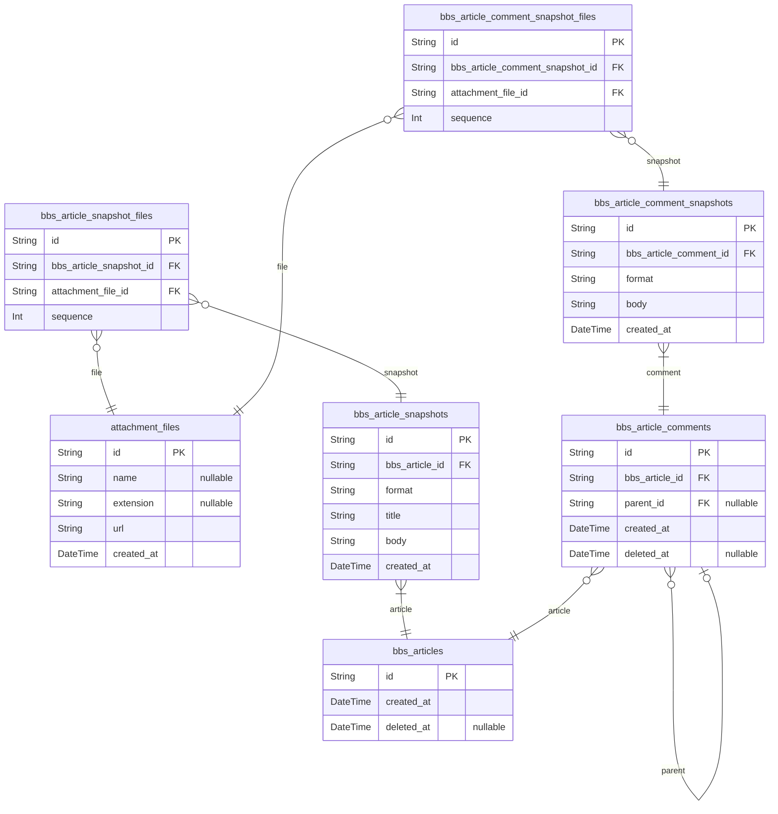
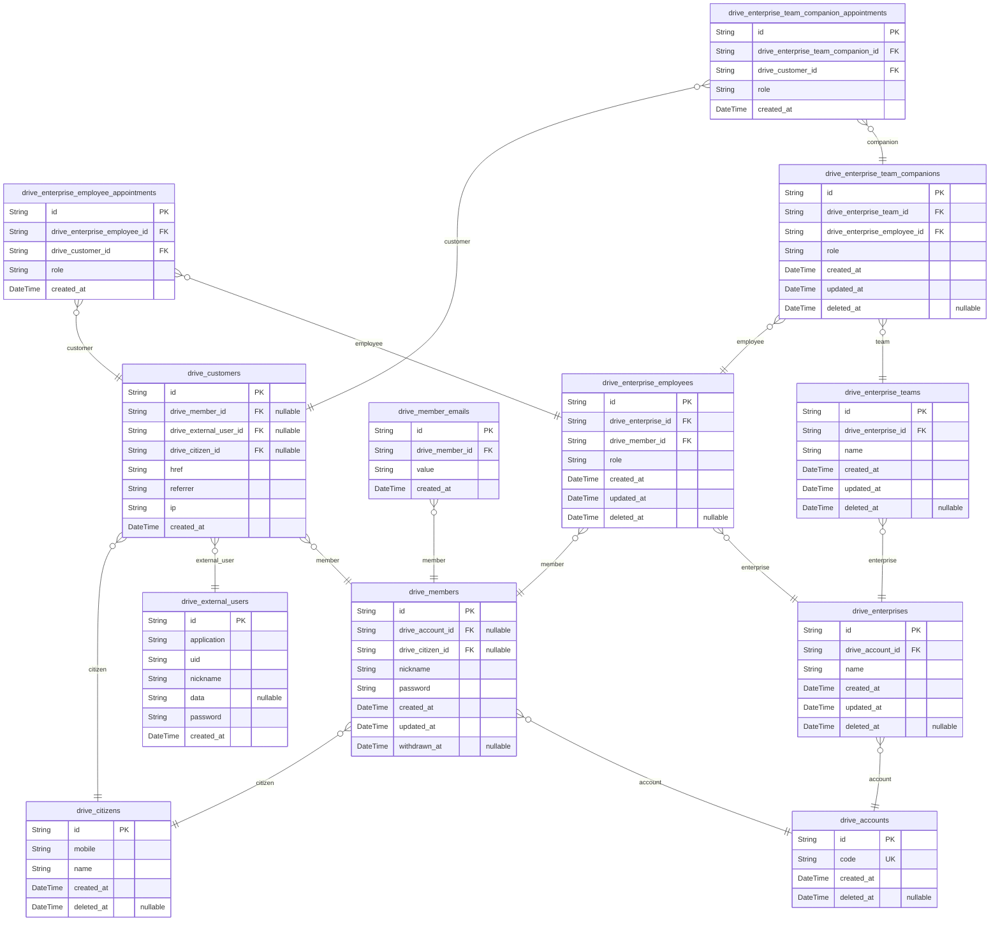
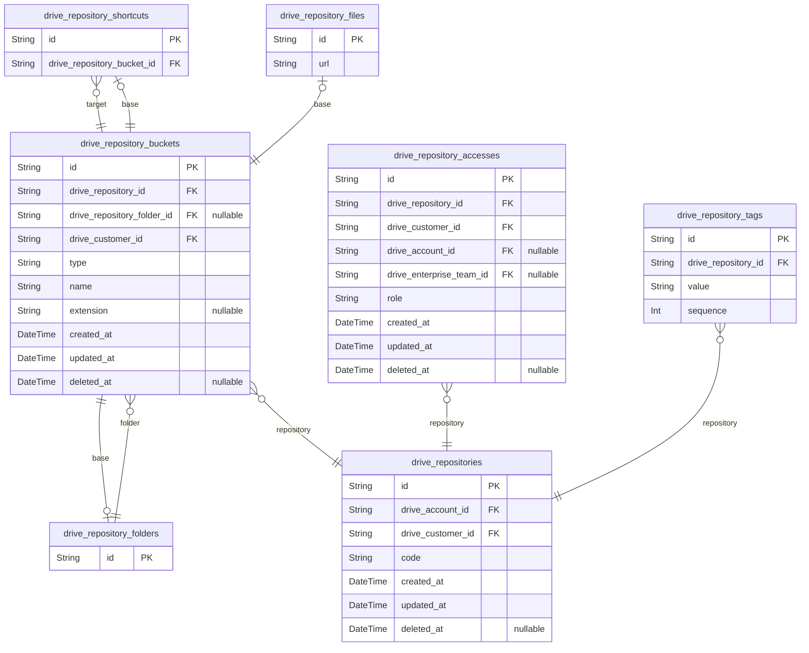
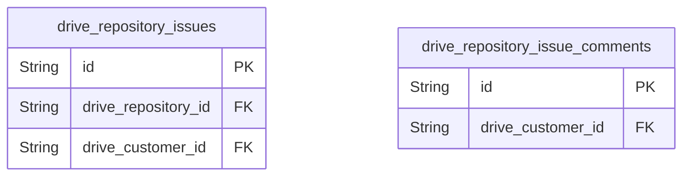

# Virtual Drive System
> Generated by [`prisma-markdown`](https://github.com/samchon/prisma-markdown)

- [Articles](#Articles)
- [Actors](#Actors)
- [Repositories](#Repositories)
- [Issues](#Issues)

## Articles

### `attachment_files`
Attachment File.

Every attachment files that are managed in this drive mall system.

For reference, it is possible to omit one of file name or extension like 
`.gitignore` or `README` case, but not possible to omit both of them,

**Properties**
  - `id`: Primary Key.
  - `name`
    > File name, except extension.
    > 
    > Possible to omit like `.gitignore` case.
  - `extension`
    > Extension.
    > 
    > Possible to omit like `README` case.
  - `url`: URL path of the real file.
  - `created_at`: Creation time of record.

### `bbs_articles`
Article entity.

`bbs_articles` is a super-type entity of all kinds of articles in the 
current drive mall system, literally shaping individual articles of 
the bulletin board.

And, as you can see, the elements that must inevitably exist in the 
article, such as the title or the body, do not exist in the `bbs_articles`, 
but exist in the subsidiary entity, [bbs_article_snapshots](#bbs_article_snapshots), as a 
1: N relationship, which is because a new snapshot record is published 
every time the article is modified.

The reason why a new snapshot record is published every time the article 
is modified is to preserve the evidence. Due to the nature of e-community, 
there is always a threat of dispute among the participants. And it can 
happen that disputes arise through articles or comments, and to prevent 
such things as modifying existing articles to manipulate the situation, 
the article is designed in this structure.

In other words, to keep evidence, and prevent fraud.

**Properties**
  - `id`: Primary Key.
  - `created_at`: Creation time of article.
  - `deleted_at`
    > Deletion time of article.
    > 
    > To keep evidence, do not delete the article, but just mark it as 
    > deleted.

### `bbs_article_snapshots`
Snapshot of article.

`bbs_article_snapshots` is a snapshot entity that contains the contents of
the article, as mentioned in [bbs_articles](#bbs_articles), the contents of the 
article are separated from the article record to keep evidence and prevent 
fraud.

**Properties**
  - `id`: Primary Key.
  - `bbs_article_id`: Belong article's [bbs_articles.id](#bbs_articles)
  - `format`
    > Format of body.
    > 
    > Same meaning with extension like `html`, `md`, `txt`.
  - `title`: Title of article.
  - `body`: Content body of article.
  - `created_at`
    > Creation time of record.
    > 
    > It means creation time or update time or article.

### `bbs_article_snapshot_files`
Attachment file of article snapshot.

`bbs_article_snapshot_files` is an entity that shapes the attached files of
the article snapshot.

`bbs_article_snapshot_files` is a typical pair relationship table to 
resolve the M: N relationship between [bbs_article_snapshots](#bbs_article_snapshots) and
[attachment_files](#attachment_files) tables. Also, to ensure the order of the attached
files, it has an additional `sequence` attribute, which we will continue to
see in this documents.

**Properties**
  - `id`: Primary Key.
  - `bbs_article_snapshot_id`: Belonged snapshot's [bbs_article_snapshots.id](#bbs_article_snapshots)
  - `attachment_file_id`: Belonged file's [attachment_files.id](#attachment_files)
  - `sequence`: Sequence of attachment file in the snapshot.

### `bbs_article_comments`
Comment written on an article.

`bbs_article_comments` is an entity that shapes the comments written on an
article.

And for this comment, as in the previous relationship between 
[bbs_articles](#bbs_articles) and [bbs_article_snapshots](#bbs_article_snapshots), the content body 
of the comment is stored in the sub [bbs_article_comment_snapshots](#bbs_article_comment_snapshots) 
table for evidentialism, and a new snapshot record is issued every time 
the comment is modified.

Also, `bbs_article_comments} is expressing the relationship of the 
hierarchical reply structure through the `parent_id` attribute.

**Properties**
  - `id`: Primary Key.
  - `bbs_article_id`: Belonged article's [bbs_articles.id](#bbs_articles)
  - `parent_id`
    > Parent comment's [bbs_article_comments.id](#bbs_article_comments)
    > 
    > Used to express the hierarchical reply structure.
  - `created_at`: Creation time of comment.
  - `deleted_at`
    > Deletion time of comment.
    > 
    > Do not allow to delete the comment, but just mark it as deleted, 
    > to keep evidence.

### `bbs_article_comment_snapshots`
Snapshot of comment.

`bbs_article_comment_snapshots` is a snapshot entity that contains the 
contents of the comment.

As mentioned in [bbs_article_comments](#bbs_article_comments), designed to keep evidence 
and prevent fraud.

**Properties**
  - `id`: Primary Key.
  - `bbs_article_comment_id`: Belonged article's [bbs_article_comments.id](#bbs_article_comments)
  - `format`
    > Format of content body.
    > 
    > Same meaning with extension like `html`, `md`, `txt`.
  - `body`: Content body of comment.
  - `created_at`
    > Creation time of record.
    > 
    > It means creation time or update time or comment.

### `bbs_article_comment_snapshot_files`
Attachment file of comment snapshot.

`bbs_article_comment_snapshot_files` is an entity resolving the M:N 
relationship between [bbs_article_comment_snapshots](#bbs_article_comment_snapshots) and 
[attachment_files](#attachment_files) tables.

**Properties**
  - `id`: Primary Key.
  - `bbs_article_comment_snapshot_id`: Belonged snapshot's [bbs_article_comment_snapshots.id](#bbs_article_comment_snapshots)
  - `attachment_file_id`: Belonged file's [attachment_files.id](#attachment_files)
  - `sequence`
    > Sequence order.
    > 
    > Sequence order of the attached file in the belonged snapshot.

## Actors

### `drive_customers`

**Properties**
  - `id`: Primary Key.
  - `drive_member_id`: Belonged member's [drive_members.id](#drive_members)
  - `drive_external_user_id`: Belonged external service user's [drive_external_users.id](#drive_external_users)
  - `drive_citizen_id`: Belonged citizen's [drive_citizens.id](#drive_citizens)
  - `href`
    > Connection URL.
    > 
    > [window.location.href](#window)
  - `referrer`
    > Referrer URL.
    > 
    > [window.document.referrer](#window)
  - `ip`: IP address,
  - `created_at`
    > Creation time of record.
    > 
    > It means the time when the customer connected to the drive mall.

### `drive_external_users`

**Properties**
  - `id`: Primary Key.
  - `application`
    > Identifier code of the external service.
    > 
    > It can be same with [drive_channels.code](#drive_channels) in common.
  - `uid`: Identifier key of external user from the external system.
  - `nickname`: Nickname of external user in the external system.
  - `data`: Additional information about external user from the external system.
  - `password`
    > Password of external user from the external system.
    > 
    > This is a password issued to the user by an external service, and is 
    > by no means the actual user password. However, for customers who 
    > entered the same application and code as the current external system 
    > user, this is to determine whether to view this as a correct external 
    > system user or a violation.
  - `created_at`
    > Creation time of record.
    > 
    > Another word, first time when the external user connected.

### `drive_citizens`

**Properties**
  - `id`: Primary Key.
  - `mobile`: Mobile phone number.
  - `name`: Real name, or equivalent name identifiable.
  - `created_at`
    > Creation time of record.
    > 
    > In other words, the 1st time of citizen activation.
  - `deleted_at`: Deletion time of record.

### `drive_members`

**Properties**
  - `id`: Primary Key.
  - `drive_account_id`: Belonged account's [drive_accounts.id](#drive_accounts)
  - `drive_citizen_id`: Belonged citizen's [drive_citizens.id](#drive_citizens)
  - `nickname`: Nickname.
  - `password`: Password for log-in.
  - `created_at`
    > Creation time of record.
    > 
    > In other words, the joining time.
  - `updated_at`: Update time of record.
  - `withdrawn_at`: Deletion time of record.

### `drive_member_emails`

**Properties**
  - `id`: 
  - `drive_member_id`: Belonged member's [drive_members.id](#drive_members)
  - `value`: Email address.
  - `created_at`: Creation time of record.

### `drive_accounts`

**Properties**
  - `id`: Primary Key.
  - `code`: Identifer code of the account.
  - `created_at`: Creation time of record.
  - `deleted_at`: Deletion time of record.

### `drive_enterprises`

**Properties**
  - `id`: Primary Key.
  - `drive_account_id`: Belonged account's [drive_accounts.id](#drive_accounts)
  - `name`: 
  - `created_at`: 
  - `updated_at`: 
  - `deleted_at`: 

### `drive_enterprise_employees`

**Properties**
  - `id`: Primary Key.
  - `drive_enterprise_id`: 
  - `drive_member_id`: 
  - `role`: 
  - `created_at`: 
  - `updated_at`: 
  - `deleted_at`: 

### `drive_enterprise_employee_appointments`

**Properties**
  - `id`: Primary Key.
  - `drive_enterprise_employee_id`: 
  - `drive_customer_id`: 
  - `role`: 
  - `created_at`: 

### `drive_enterprise_teams`

**Properties**
  - `id`: Primary Key.
  - `drive_enterprise_id`: 
  - `name`: 
  - `created_at`: 
  - `updated_at`: 
  - `deleted_at`: 

### `drive_enterprise_team_companions`

**Properties**
  - `id`: Primary Key.
  - `drive_enterprise_team_id`: 
  - `drive_enterprise_employee_id`: 
  - `role`: 
  - `created_at`: 
  - `updated_at`: 
  - `deleted_at`: 

### `drive_enterprise_team_companion_appointments`

**Properties**
  - `id`: Primary Key.
  - `drive_enterprise_team_companion_id`: 
  - `drive_customer_id`: 
  - `role`: 
  - `created_at`: 

## Repositories

### `drive_repositories`

**Properties**
  - `id`: Primary Key.
  - `drive_account_id`: 
  - `drive_customer_id`: 
  - `code`: 
  - `created_at`: 
  - `updated_at`: 
  - `deleted_at`: 

### `drive_repository_buckets`

**Properties**
  - `id`: Primary Key.
  - `drive_repository_id`: 
  - `drive_repository_folder_id`: 
  - `drive_customer_id`: 
  - `type`: 
  - `name`: 
  - `extension`: 
  - `created_at`: 
  - `updated_at`: 
  - `deleted_at`: 

### `drive_repository_folders`

**Properties**
  - `id`: PK + FK.

### `drive_repository_files`

**Properties**
  - `id`: PK + FK.
  - `url`: 

### `drive_repository_shortcuts`

**Properties**
  - `id`: PK + FK.
  - `drive_repository_bucket_id`: 

### `drive_repository_accesses`

**Properties**
  - `id`: Primary Key.
  - `drive_repository_id`: 
  - `drive_customer_id`: 
  - `drive_account_id`: 
  - `drive_enterprise_team_id`: 
  - `role`: 
  - `created_at`: 
  - `updated_at`: 
  - `deleted_at`: 

### `drive_repository_tags`

**Properties**
  - `id`: Primary Key.
  - `drive_repository_id`: 
  - `value`: 
  - `sequence`: 

## Issues

### `drive_repository_issues`

**Properties**
  - `id`: Primary Key.
  - `drive_repository_id`: 
  - `drive_customer_id`: 

### `drive_repository_issue_comments`

**Properties**
  - `id`: Primary Key.
  - `drive_customer_id`: 