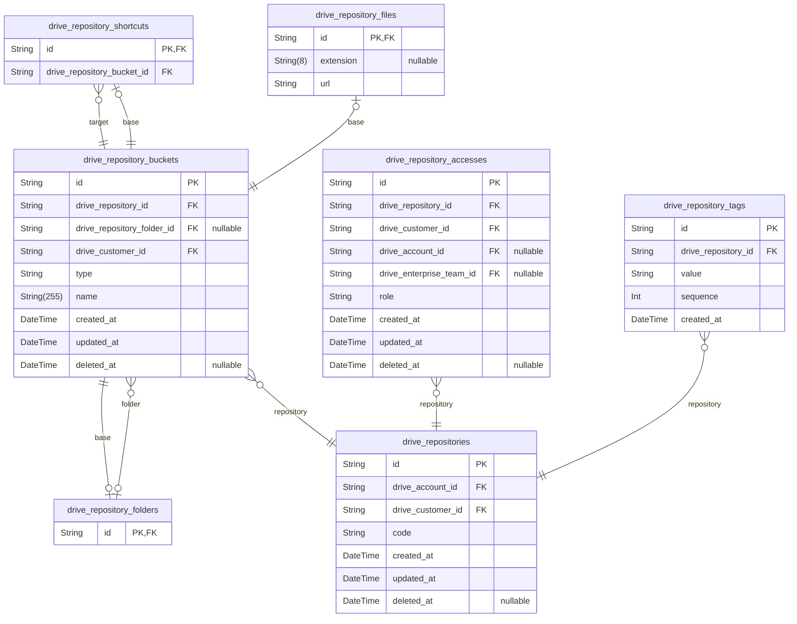

# Virtual Drive System

> Generated by [`prisma-markdown`](https://github.com/samchon/prisma-markdown)

- [Actors](#actors)
- [Repositories](#repositories)

## Actors

### `drive_customers`

Customer information, but not a person but a **connection** basis.

`drive_customers` is an entity that literally embodies the information
of those who participated in the drive system as customers. By the way,
the `drive_customers` does not mean a person, but a **connection** basis.
Therefore, even if the same person connects to the drive system multiple,
multiple records are created in `drive_customers`.

The first purpose of this is to track the customer's inflow path in detail,
and it is for cases where the same person enters as a non-member, reads a
[repository file](#drive_repository_files) in advance, and registers/logs
in at the moment for modification. It is the second. Lastly, it is to
accurately track the activities that a person performs at the drive system
in various ways like below.

- Same person comes from an [external service](#drive_external_users)
- Same person creates multiple [accounts](#drive_members)
- Same person makes a download with only [real name authentication](#drive_citizens)

Therefore, `drive_customers` can have multiple records with the same
[drive_citizens](#drive_citizens), [drive_members](#drive_members), and [drive_external_users](#drive_external_users).
Additionally, if a customer signs up for membership after verifying their real
name or signs up for our service after being a user of an external service,
all related records are changed at once. Therefore, identification and tracking
of customers can be done very systematically.

Properties as follows:

- `id`: Primary Key.
- `drive_member_id`: Belonged member's [drive_members.id](#drive_members)
- `drive_external_user_id`: Belonged external service user's [drive_external_users.id](#drive_external_users)
- `drive_citizen_id`: Belonged citizen's [drive_citizens.id](#drive_citizens)
- `href`
  > Connection URL.
  >
  > [window.location.href](#window)
- `referrer`
  > Referrer URL.
  >
  > [window.document.referrer](#window)
- `ip`: IP address,
- `created_at`
  > Creation time of record.
  >
  > It means the time when the customer connected to the drive system.

### `drive_external_users`

External user information.

`drive_external_users` is an entity dsigned for when this system needs
to connect with external services and welcome their users as customers of
this service.

For reference, customers who connect from an external service must have
this record, and the external service user is identified through the two
attributes `application` and `uid`. If a customer connected from an
external service completes [real-name authentication](#drive_citizens)
from this service, each time the external service user reconnects to this
service and issues a new [customer](#drive_customers) authentication
token, [real-name authentication](#drive_citizens) begins with
completed.

And `password` is the password issued to the user by the external service
system (the so-called permanent user authentication token), and is never
the actual user password. However, for customers who entered the same
`application` and `uid` as the current external system user, this is to
determine whether to view this as a correct external system user or a
violation.

In addition, additional information received from external services can
be recorded in the `data` field in JSON format.

Properties as follows:

- `id`: Primary Key.
- `application`
  > Identifier code of the external service.
  >
  > It can be same with [drive_channels.code](#drive_channels) in common.
- `uid`: Identifier key of external user from the external system.
- `nickname`: Nickname of external user in the external system.
- `data`: Additional information about external user from the external system.
- `password`
  > Password of external user from the external system.
  >
  > This is a password issued to the user by an external service, and is
  > by no means the actual user password. However, for customers who
  > entered the same application and code as the current external system
  > user, this is to determine whether to view this as a correct external
  > system user or a violation.
- `created_at`
  > Creation time of record.
  >
  > Another word, first time when the external user connected.

### `drive_citizens`

Citizen verification information.

`drive_citizens` is an entity that records the user's real name and
mobile input information.

For reference, in South Korea, real name authentication is required for
[employeed](#drive_enterprise_employees) people, so the `name` attribute
is important. However, the situation is different overseas, so in reality,
`mobile` attributes are the most important, and identification of individual
users is also done based on this mobile.

Of course, real name and mobile phone authentication information are
encrypted and stored.

Properties as follows:

- `id`: Primary Key.
- `mobile`: Mobile phone number.
- `name`: Real name, or equivalent name identifiable.
- `created_at`
  > Creation time of record.
  >
  > In other words, the 1st time of citizen activation.
- `deleted_at`: Deletion time of record.

### `drive_members`

Member Account.

`drive_members` is an entity that symbolizes the case when a user
signs up as a member of this system.

For reference, it is possible to travel other public
[repositories](#drive_repositories) without joining membership. Otherwise,
if you want to create your own repository or participate into some
[enterprise](#drive_enterprises) as an
[employee](#drive_enterprise_employees), you must join as a member.

Properties as follows:

- `id`: Primary Key.
- `drive_account_id`: Belonged account's [drive_accounts.id](#drive_accounts)
- `drive_citizen_id`: Belonged citizen's [drive_citizens.id](#drive_citizens)
- `nickname`: Nickname.
- `password`: Password for log-in.
- `created_at`
  > Creation time of record.
  >
  > In other words, the joining time.
- `updated_at`: Update time of record.
- `withdrawn_at`: Deletion time of record.

### `drive_member_emails`

Email address of member.

This system allows multiple email addresses to be registered for one
[member](#drive_members). If you don't have to plan such multiple
email addresses, just use only one.

Properties as follows:

- `id`:
- `drive_member_id`: Belonged member's [drive_members.id](#drive_members)
- `value`: Email address.
- `created_at`: Creation time of record.

### `drive_accounts`

Account entity.

`drive_accounts` is an entity that represents the accounts of the drive
system. An account is a subject unit with a unique identifier code and can
own storage, etc. For example, if the address of a specific repository on
GitHub is [https://github.com/samchon/typia](https://github.com/samchon/typia), "samchon" is the account
identifier and the owner of the repository called "typia".

And the account referred to here does not necessarily refer to a person. This
is because the account holder may be a [member](#drive_members), but it
may also be an [enterprise](#drive_enterprises). For example, in the case
of [https://github.com/Microsoft/TypeScript](https://github.com/Microsoft/TypeScript), the account owner is not a person,
but Microsoft, an enterprise.

In addition, an account can change its owner. And when changing ownership, it
is also possible for the entity to change from an individual to an enterprise.
For example, this may be the case when an account or repository that started
as an individual becomes successful and is promoted to an enterprise in the
future.

Properties as follows:

- `id`: Primary Key.
- `code`: Identifer code of the account.
- `created_at`: Creation time of record.
- `deleted_at`: Deletion time of record.

### `drive_enterprises`

Enterprise, a enterprise entity.

drive_enterprises is an entity that symbolizes an enterprise, and literally
refers to the subjects participating in the drive system on a enterprise basis.
And in the case of enterprise, unlike [member](#drive_members), it must
have an [account](#drive_accounts).

Enterprises also have as sub-entities [employees](#drive_enterprise_employees)
and [teams](#drive_enterprise_teams) composed of them. And among these,
a team can have its [companions](#drive_enterprise_team_companions)
collectively have the same [access rights](#drive_repository_accesses) to
enterprise [repositories](#drive_repositories).

Properties as follows:

- `id`: Primary Key.
- `drive_account_id`: Belonged account's [drive_accounts.id](#drive_accounts)
- `name`: Representative name of the enterprise.
- `created_at`: Creation time of record.
- `updated_at`: Update time of record.
- `deleted_at`: Deletion time of record.

### `drive_enterprise_employees`

Employee entity within a enterprise.

`drive_enterprise_employees` is an entity that represents employees belonging
to an [enterprise](#drive_enterprises). Employees work as part of each
[team](#drive_enterprise_teams) within the enterprise, and are granted
[accessibility](#drive_repository_accesses) on a team-by-team basis from
the enterprise's repository.

Please note that only those who have registered as [members](#drive_members)
of this drive system can be
[appointed](#drive_enterprise_employee_appointments) as employees, and it
is possible for one person to belong to multiple enterprises as an employee at
the same time.

Properties as follows:

- `id`: Primary Key.
- `drive_enterprise_id`: Belonged enterprise's [drive_enterprises.id](#drive_enterprises)
- `drive_member_id`: Belonged member's [drive_members.id](#drive_members)
- `role`: Role of employee.
- `created_at`: Creation time of record.
- `updated_at`: Update time of record.
- `deleted_at`: Deletion time of record.

### `drive_enterprise_employee_appointments`

Employee Appointment Information.

`drive_enterprise_employee_appointments` is an entity that embodies the history
of appointment and position change information of
[employees](#drive_enterprise_employees) within the
[enterprise](#drive_enterprises).

Therefore, this entity record is created once when a enterprise appoints
an employee, and is accumulated each time the employee changes his or her
position thereafter.

Properties as follows:

- `id`: Primary Key.
- `drive_enterprise_employee_id`: Belonged employee's [drive_enterprise_employees.id](#drive_enterprise_employees)
- `drive_customer_id`: Creator customer's [drive_customers.id](#drive_customers)
- `role`: Role of employee at that time.
- `created_at`: Creation time of record.

### `drive_enterprise_teams`

Team information within the enterprise.

`drive_enterprise_teams` is an entity that embodies a team within an
[enterprise](#drive_enterprises). A team has
[employees](#drive_enterprise_employees) as
[companions](#drive_enterprise_team_companions), and each team can operate
by receiving [permission](#drive_repository_accesses) from the enterprise's
[repository](#drive_repositories).

Properties as follows:

- `id`: Primary Key.
- `drive_enterprise_id`: Belonged enterprise's [drive_enterprises.id](#drive_enterprises)
- `code`: Identifier code of the team.
- `name`: Representative name of the team.
- `created_at`: Creation time of record.
- `updated_at`: Update time of record.
- `deleted_at`: Deletion time of record.

### `drive_enterprise_team_companions`

Information about companion of teams within the enterprise.

`drive_enterprise_team_companions` is an entity that represents which
[employees](#drive_enterprise_employees) are participating as companion in
each [team](#drive_enterprise_teams) that makes up the enterprise.

For reference, employees participate as companion of a team and are assigned
some kind of role, which may be different from their original position.
Additionally, it is possible for employees to belong to multiple teams at the
same time. This is similar to how it was possible for one member to be
[appointed](#drive_enterprise_employee_appointments) as an employee at
multiple enterprises at the same time.

Properties as follows:

- `id`: Primary Key.
- `drive_enterprise_team_id`: Belonged team's [drive_enterprise_teams.id](#drive_enterprise_teams)
- `drive_enterprise_employee_id`: Belonged employee's [drive_enterprise_employees.id](#drive_enterprise_employees)
- `role`: Role in the team.
- `created_at`: Creation time of record.
- `updated_at`: Update time of record.
- `deleted_at`: Deletion time of record.

### `drive_enterprise_team_companion_appointments`

Appointment information for team companions within the enterprise.

`drive_enterprise_team_companion_appointments` is an entity that embodies
the history of appointment and role change information of
[team companion](#drive_enterprise_team_companions) within the
[enterprise](#drive_enterprises).

Therefore, this entity record is first created when the team appoints a
companion, and is accumulated each time the companion changes roles
thereafter.

Properties as follows:

- `id`: Primary Key.
- `drive_enterprise_team_companion_id`: Belonged team companion's [drive_enterprise_team_companions.id](#drive_enterprise_team_companions)
- `drive_customer_id`: Creator customer's [drive_customers.id](#drive_customers)
- `role`: Role of team companion at that time.
- `created_at`: Creation time of record.

## Repositories

### `drive_repositories`

Repository storing buckets.

`drive_repositories` is an entity that represents individual repositories
within the drive system, and is similar to the Google Drive in online services.
And physically, it is a concept that can be compared to a Disk Drive.

And the repository belongs to a specific [account](#drive_accounts), and
the account owner who owns each repository may be a
[member](#drive_members) or an [enterprise](#drive_enterprises). In
addition, the account owner who created the repository can use the repository
with fellow members or [team](#drive_enterprise_teams) companion through
controlling [access rights](#drive_repository_accesses) to the repository.

Properties as follows:

- `id`: Primary Key.
- `drive_account_id`: Belonged account's [drive_accounts.id](#drive_accounts)
- `drive_customer_id`: Creator customer's [drive_customers.id](#drive_customers)
- `code`: Identifier code of repository.
- `created_at`: Creation time of record.
- `updated_at`: Update time of record.
- `deleted_at`: Deletion time of record.

### `drive_repository_buckets`

Bucket information within the repository.

`drive_repository_buckets` symbolizes buckets that exist in the
[repository](#drive_repositories), and corresponds to the supertype
entities of [folders](#drive_repository_folders),
[files](#drive_repository_files), and
[shortcut icons](#drive_repository_shortcuts), respectively. In other
/ words, it is a table that stores common information about files and folders.

Properties as follows:

- `id`: Primary Key.
- `drive_repository_id`: Belonged repository's [drive_repositories.id](#drive_repositories)
- `drive_repository_folder_id`: Belonged folder's [drive_repository_folders.id](#drive_repository_folders)
- `drive_customer_id`: Creator customer's [drive_customers.id](#drive_customers)
- `type`
  > Type of bucket.
  >
  > Discriminator of the supertype entity.
  >
  > - directory
  > - file
  > - shortcut
- `name`: Name of the bucket.
- `created_at`: Creation time of record.
- `updated_at`: Update time of record.
- `deleted_at`: Deletion time of record.

### `drive_repository_folders`

Folder (directory).

`drive_repository_folders` is an entity that represents a folder in the
[repository](#drive_repositories).

Properties as follows:

- `id`: PK + FK.

### `drive_repository_files`

File.

`drive_repository_files` is an entity that represents files in the
[repository](#drive_repositories).

And the location where the file is physically stored is recorded in the
attribute url.

Properties as follows:

- `id`: PK + FK.
- `extension`: Extension of file.
- `url`:

### `drive_repository_shortcuts`

Shortcut icon.

`drive_repository_shortcuts` is an entity that symbolizes a shortcut icon in
the [repository](#drive_repositories) and has a reference function for
other [buckets](#drive_repository_buckets) in the repository.

A concept that is exactly the same as a shortcut icon in Windows and
a symbolic link in Linux.

Properties as follows:

- `id`: PK + FK.
- `drive_repository_bucket_id`
  > Target bucket's [drive_repository_buckets.id](#drive_repository_buckets)
  >
  > This shortcut references the target bucket.

### `drive_repository_accesses`

Storage access control.

`drive_repository_accesses` is an entity that embodies the access authority
control of the [repository](#drive_repositories), and is an entity that
is recorded when the [account](#drive_accounts) owner distributes the
authority of the repository to other [members](#drive_members) or an
[enterprise team](#drive_enterprise_teams).

For reference, the account owner who created the repository is also recorded
in access permission control. In other words, as soon as the account owner
creates the repository, one table record is created and started.

Properties as follows:

- `id`: Primary Key.
- `drive_repository_id`: Belonged repository's [drive_repositories.id](#drive_repositories)
- `drive_customer_id`: Creator customer's [drive_customers.id](#drive_customers)
- `drive_account_id`: Target account's [drive_members.id](#drive_members)
- `drive_enterprise_team_id`: Target enterprise team's [drive_enterprise_teams.id](#drive_enterprise_teams)
- `role`: Role of access permission.
- `created_at`: Creation time of record.
- `updated_at`: Update time of record.
- `deleted_at`: Deletion time of record.

### `drive_repository_tags`

Search tag of repository.

Properties as follows:

- `id`: Primary Key.
- `drive_repository_id`: Belonged repository's [drive_repositories.id](#drive_repositories)
- `value`: Search tag value.
- `sequence`: Creation time of record.
- `created_at`:
